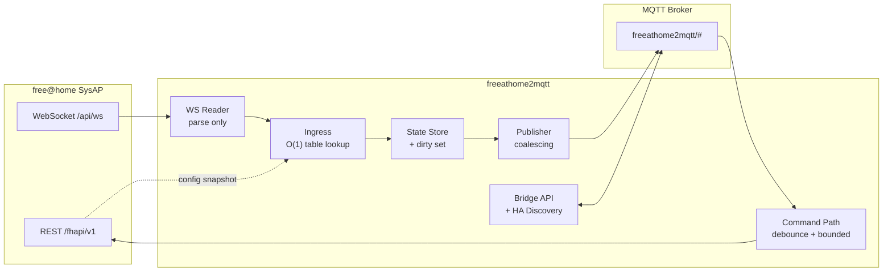

# freeathome2mqtt

A high-performance bridge between an **ABB / Busch-Jaeger free@home** System Access Point (SysAP)
and **MQTT**.

> **Status: [WP0](docs/11-implementation-plan.md#wp0--bootstrap)–[WP8](docs/11-implementation-plan.md#wp8--supervisor-lifecycle-resilience)
> landed.** Bootstrap tooling, the generated pairing/function/parameter/interface code tables, the
> SysAP settings pre-flight, the capture tool's pseudonymisation, the `minimal`/`typical`/`nasty`
> configuration fixtures, a real SysAP client (`RestClient`, `WsReader` against a from-scratch fake
> SysAP), the domain model (codecs, slugify + deterministic collision resolution, the
> `Entity`/`Binding`/`EgressBinding` runtime shapes, a JSON-Schema-validated profile loader, and the
> pure `compile()`), a real tier-1 profile set — 13 profiles covering switches, dimmers,
> colour-temperature lighting, covers (plain and slatted), climate, and the common sensor types,
> each with a round-trip fixture, plus the `room_temperature_controller`/`cover_with_slats`
> transforms — real MQTT connectivity: `MqttClient` (LWT, narrow ADR-006 subscriptions,
> backoff+jitter reconnect that never gives up, retained republish after reconnect), the
> coalescing state-publish loop (`StateStore` + `Publisher`, docs/05 §4.1), and the non-coalescing
> event path for buttons/triggers, all tested against a real in-process broker rather than a mock —
> the ingest hot path itself: `Ingress` (docs/02 §4), fully synchronous end to end so a slow MQTT
> publish can never block the WebSocket reader (rule R1), plus `metrics.py`'s counters — and now the
> command path: `CommandDispatcher` (object/attribute/scalar `/set` forms, docs/04 §3;
> validate-then-clamp; leading+trailing debounce with reset-on-each-message semantics so a held
> slider costs one extra write regardless of drag length, docs/05 §4.2; rate-limited `/get`) and
> `Reconciler` (ADR-012's optimistic-write safety net: a 3 s per-attribute timer that self-cancels
> on a confirming WS echo, one targeted read and a rollback otherwise) — and now the supervisor:
> `Supervisor` (docs/02 §7 startup order — LWT armed before the SysAP is ever touched, the
> WebSocket buffers before the configuration is fetched, then discovery-then-state-then-online;
> one `asyncio.TaskGroup` with a restart-with-backoff shim that escalates and exits the process
> after five rapid failures; resync on a WS reconnect, a debounced topology change, or a periodic
> hash-gated refresh, publishing only what actually changed and retracting entities that
> disappeared; a graceful shutdown that flushes pending commands and state before an explicit
> `bridge/state: offline`), `BridgeAvailability`/`DeviceAvailabilityPublisher` (ADR-008's
> end-to-end health signal plus per-device `unresponsive`/`defect`), and `EntitiesStore`
> (versioned, atomically-written `entities.json`). 100% of the `typical.json` fixture's channels
> match a profile (floor: 85%); `bench_latency`/`bench_ingest`/`bench_command_debounce`/
> `bench_resync` all meet their P1–P8 budgets against the real pipeline. The documents under
> [`docs/`](docs/) are written to be executed by an implementing agent (human or AI) top to bottom,
> and [WP9](docs/11-implementation-plan.md#wp9--bridge-api-and-configuration) (bridge API,
> settings, logging, CLI) is next.

---

## What this is

The SysAP exposes a *local* REST + WebSocket API (firmware ≥ 2.6.0). It is the only sanctioned
way to read and write the free@home bus without cloud dependency. It is, however, a low-powered
embedded device with a chatty, string-typed, hex-keyed protocol and no built-in notion of
"entities".

`freeathome2mqtt` sits in between and provides:

- **One MQTT topic tree** that is stable, documented, and broker-friendly.
- **Home Assistant MQTT Discovery** as an optional layer on top (not the primary contract).
- **Sub-50 ms** bus-event → MQTT publish latency at p99, with burst coalescing so a scene that
  flips 200 datapoints produces ~30 publishes rather than 200.
- **Protection of the SysAP** — command debouncing and bounded concurrency, so a slider drag
  does not knock the access point over.
- **Correct resynchronisation** after a link loss, in *one* HTTP request instead of N.

## Read the plan in this order

| # | Document | What it settles |
|---|----------|-----------------|
| 0 | [Overview & Decisions](docs/00-overview-and-decisions.md) | Goals, scale targets, stack, 12 architecture decision records |
| 1 | [free@home Local API](docs/01-freeathome-api.md) | Endpoints, JSON schemas, WebSocket protocol, value semantics |
| 2 | [Architecture](docs/02-architecture.md) | Components, module layout, concurrency model, the hot path |
| 3 | [Model & Channel Profiles](docs/03-model-and-profiles.md) | Entity model, declarative profile format, codecs, compilation |
| 4 | [MQTT Interface](docs/04-mqtt-interface.md) | Full topic + payload reference, bridge API, HA discovery |
| 5 | [Performance](docs/05-performance.md) | Budgets, hot-path rules, coalescing, benchmarks, anti-patterns |
| 6 | [Resilience](docs/06-resilience.md) | Link state machines, backoff, resync, availability, failure matrix |
| 7 | [Configuration](docs/07-configuration.md) | `config.yaml` schema, secrets, hot reload, persisted files |
| 8 | [Workflows](docs/08-workflows.md) | Sequence diagrams for every significant flow |
| 9 | [Pitfalls](docs/09-pitfalls.md) | 40+ catalogued traps with symptom / cause / mitigation / test |
| 10 | [Testing](docs/10-testing.md) | Fake SysAP, fixtures, property tests, benchmarks, CI |
| 11 | [Implementation Plan](docs/11-implementation-plan.md) | Work packages WP0–WP12 with acceptance criteria |

## Architecture in one picture



The central performance idea: **everything expensive happens once, at load time.** Pairing-ID
matching, function lookup, name templating and Home Assistant payload rendering are all compiled
into flat lookup tables during startup. The runtime hot path is a dict lookup, a string decode,
a comparison against the cached value, and a set insertion.

## Development

Built and tested with [`uv`](https://docs.astral.sh/uv/). See [`CLAUDE.md`](CLAUDE.md) for the full
TDD workflow this repository requires.

```bash
uv sync --group dev

uv run pytest -m "not bench and not soak"   # fast suite
uv run pytest --cov                          # with coverage; floors in CLAUDE.md §1
uv run ruff check && uv run ruff format --check
uv run mypy --strict src/
```

## Provenance

The design draws on, and deliberately diverges from, three projects:

- [`local-abbfreeathome`](https://github.com/kingsleyadam/local-abbfreeathome) (MIT) — the most
  complete open-source map of free@home function IDs to device semantics. Used as a
  **specification source**, not a runtime dependency ([ADR-002](docs/00-overview-and-decisions.md#adr-002)).
- [`local-abbfreeathome-hass`](https://github.com/kingsleyadam/local-abbfreeathome-hass) — proves
  the entity mapping and config-flow ergonomics.
- [`zigbee2mqtt`](https://github.com/Koenkk/zigbee2mqtt) (GPL-3.0) — the reference for what a
  good MQTT bridge's topic tree, bridge API and HA discovery layer look like. Its conventions are
  followed where they are good and improved where they are not (see
  [ADR-006](docs/00-overview-and-decisions.md#adr-006), [ADR-007](docs/00-overview-and-decisions.md#adr-007)).
- [`Busch-Jaeger/node-free-at-home`](https://github.com/Busch-Jaeger/node-free-at-home) — the
  vendor's own library; its OpenAPI-generated models are the authoritative wire schema.

## License

[MIT](LICENSE). Decided in WP0 — see [ADR-002](docs/00-overview-and-decisions.md#adr-002) for the
licence implications of vendoring generated code tables from `local-abbfreeathome` (MIT) and
`Busch-Jaeger/node-free-at-home` (ISC).
