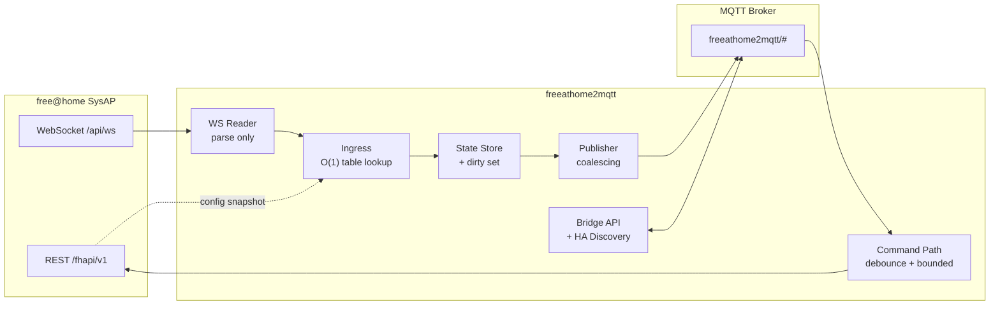

# freeathome2mqtt

A high-performance bridge between an **ABB / Busch-Jaeger free@home** System Access Point (SysAP)
and **MQTT**.

> **Status: [WP0](docs/11-implementation-plan.md#wp0--bootstrap)–[WP11](docs/11-implementation-plan.md#wp11--tier-23-profiles-and-raw-mode)
> landed.** Bootstrap tooling, the generated pairing/function/parameter/interface code tables, the
> SysAP settings pre-flight, the capture tool's pseudonymisation, the `minimal`/`typical`/`nasty`
> configuration fixtures, a real SysAP client (`RestClient`, `WsReader` against a from-scratch fake
> SysAP), the domain model (codecs, slugify + deterministic collision resolution, the
> `Entity`/`Binding`/`EgressBinding` runtime shapes, a JSON-Schema-validated profile loader, and the
> pure `compile()`), a real tier-1 profile set — 15 profiles covering switches, dimmers,
> colour-temperature lighting, covers (plain and slatted), climate, and the common sensor types,
> each with a round-trip fixture, plus the `room_temperature_controller`/`cover_with_slats`
> transforms — real MQTT connectivity: `MqttClient` (LWT, narrow ADR-006 subscriptions,
> backoff+jitter reconnect that never gives up, retained republish after reconnect), the
> coalescing state-publish loop (`StateStore` + `Publisher`, docs/05 §4.1), and the non-coalescing
> event path for buttons/triggers, all tested against a real in-process broker rather than a mock —
> the ingest hot path itself: `Ingress` (docs/02 §4), fully synchronous end to end so a slow MQTT
> publish can never block the WebSocket reader (rule R1), plus `metrics.py`'s counters — and now the
> command path: `CommandDispatcher` (object/attribute/scalar `/set` forms, docs/04 §3;
> validate-then-clamp; leading+trailing debounce with reset-on-each-message semantics so a held
> slider costs one extra write regardless of drag length, docs/05 §4.2; rate-limited `/get`) and
> `Reconciler` (ADR-012's optimistic-write safety net: a 3 s per-attribute timer that self-cancels
> on a confirming WS echo, one targeted read and a rollback otherwise) — and now the supervisor:
> `Supervisor` (docs/02 §7 startup order — LWT armed before the SysAP is ever touched, the
> WebSocket buffers before the configuration is fetched, then discovery-then-state-then-online;
> one `asyncio.TaskGroup` with a restart-with-backoff shim that escalates and exits the process
> after five rapid failures; resync on a WS reconnect, a debounced topology change, or a periodic
> hash-gated refresh, publishing only what actually changed and retracting entities that
> disappeared; a graceful shutdown that flushes pending commands and state before an explicit
> `bridge/state: offline`), `BridgeAvailability`/`DeviceAvailabilityPublisher` (ADR-008's
> end-to-end health signal plus per-device `unresponsive`/`defect`), and `EntitiesStore`
> (versioned, atomically-written `entities.json`). 100% of the `typical.json` fixture's channels
> match a profile (floor: 85%); `bench_latency`/`bench_ingest`/`bench_command_debounce`/
> `bench_resync` all meet their P1–P8 budgets against the real pipeline — and now the bridge API and
> configuration layer: `BridgeApi` (every `bridge/request/*` command in docs/04 §5 — `reload`,
> `restart`, the ADR-010 `entity/rename` transaction, `entity/options`/`entity/remove` (a durable
> exclusion that reuses the already-tested removed-entity retraction path), `device/refresh`,
> `discovery/republish`, `log_level`, `health`, and `virtualdevice/create` with P-16's `ttl/2`
> keepalive), `log.py` (central secret redaction shared by the console output and a rate-limited
> `bridge/logging` MQTT sink, P-44/P-45), `settings.py` (the full `config.yaml` schema as pydantic
> models, `FAH2MQTT_*` environment overrides, `!env`/`!secret`/`!file` YAML tags, and every docs/07
> §2.2 semantic check), `sysap/mdns.py` (zeroconf discovery of the SysAP, tested against a real
> loopback multicast round trip), and `cli.py` (`--check-config`, `--discover`, `--capture`, and a
> `--dry-run` that connects, fetches, and compiles without ever touching MQTT) — and now Home
> Assistant MQTT discovery itself: `homeassistant/components.py` (pure, per-platform discovery
> payload builders — `switch`/`light`/`cover`/`binary_sensor`/`sensor`/`number`/`climate`/`event` —
> dispatched from each profile's own `homeassistant:` YAML block through a closed registry) and
> `homeassistant/discovery.py` (`build_model_discovery()` runs *after* `compile()` and mutates
> `Entity.discovery` in place — non-frozen since WP3 for exactly this reason — plus
> `DiscoveryPublisher`: changed-only publishing backed by a new `discovery.json` store, so a
> restart with an unchanged installation publishes zero discovery messages, with a delayed
> republish on the Home Assistant birth message, P-36/P-37); `supervisor.py` now also builds and
> splits the `bridge/devices` inventory (P-41) and retracts discovery topics left over from a
> *previous* run (P-35). The new `bench_startup` (a 1000-channel cold start to
> `bridge/state: online`) meets its P6 budget too, alongside every earlier benchmark — and now
> tier-2/3 profiles and raw mode: 16 more profiles (air-quality/CO/rain/wind sensors, the
> push-button sensors paired to blind/dimming/staircase-light/force-on-off actuators, DES door
> opener/ringing sensor, Welcome IP mute, inverter/battery/meter power sensors — closes P-17,
> P-59), the M-Wire switch actuator folded into the existing `switch_actuator` profile, and
> `bus/raw.py`'s `advanced.raw_mode` pressure valve (`false`/`unsupported_only`/`true`): every
> output datapoint's raw wire value published verbatim under `<base>/raw/...`, plus a `.../set`
> topic that writes straight through with no codec or validation, off by default. Tier-3's
> "virtual battery/inverter/two-way-meter" needed no new profiles at all — a virtual device
> reports the same functionIDs a physical one would, so `include_virtual_devices: true` already
> covers it. The documents under [`docs/`](docs/) are written to be executed by an implementing
> agent (human or AI) top to bottom, and every module below WP11 is still a docstring-only stub.

---

## What this is

The SysAP exposes a *local* REST + WebSocket API (firmware ≥ 2.6.0). It is the only sanctioned
way to read and write the free@home bus without cloud dependency. It is, however, a low-powered
embedded device with a chatty, string-typed, hex-keyed protocol and no built-in notion of
"entities".

`freeathome2mqtt` sits in between and provides:

- **One MQTT topic tree** that is stable, documented, and broker-friendly.
- **Home Assistant MQTT Discovery** as an optional layer on top (not the primary contract).
- **Sub-50 ms** bus-event → MQTT publish latency at p99, with burst coalescing so a scene that
  flips 200 datapoints produces ~30 publishes rather than 200.
- **Protection of the SysAP** — command debouncing and bounded concurrency, so a slider drag
  does not knock the access point over.
- **Correct resynchronisation** after a link loss, in *one* HTTP request instead of N.

## Read the plan in this order

| # | Document | What it settles |
|---|----------|-----------------|
| 0 | [Overview & Decisions](docs/00-overview-and-decisions.md) | Goals, scale targets, stack, 12 architecture decision records |
| 1 | [free@home Local API](docs/01-freeathome-api.md) | Endpoints, JSON schemas, WebSocket protocol, value semantics |
| 2 | [Architecture](docs/02-architecture.md) | Components, module layout, concurrency model, the hot path |
| 3 | [Model & Channel Profiles](docs/03-model-and-profiles.md) | Entity model, declarative profile format, codecs, compilation |
| 4 | [MQTT Interface](docs/04-mqtt-interface.md) | Full topic + payload reference, bridge API, HA discovery |
| 5 | [Performance](docs/05-performance.md) | Budgets, hot-path rules, coalescing, benchmarks, anti-patterns |
| 6 | [Resilience](docs/06-resilience.md) | Link state machines, backoff, resync, availability, failure matrix |
| 7 | [Configuration](docs/07-configuration.md) | `config.yaml` schema, secrets, hot reload, persisted files |
| 8 | [Workflows](docs/08-workflows.md) | Sequence diagrams for every significant flow |
| 9 | [Pitfalls](docs/09-pitfalls.md) | 40+ catalogued traps with symptom / cause / mitigation / test |
| 10 | [Testing](docs/10-testing.md) | Fake SysAP, fixtures, property tests, benchmarks, CI |
| 11 | [Implementation Plan](docs/11-implementation-plan.md) | Work packages WP0–WP12 with acceptance criteria |

## Architecture in one picture



The central performance idea: **everything expensive happens once, at load time.** Pairing-ID
matching, function lookup, name templating and Home Assistant payload rendering are all compiled
into flat lookup tables during startup. The runtime hot path is a dict lookup, a string decode,
a comparison against the cached value, and a set insertion.

## Installation

**Docker (recommended)**

```bash
cp config.example.yaml config.yaml   # fill in sysap.host/username/password, mqtt.server
cp docker-compose.example.yml docker-compose.yml
mkdir -p data && chown -R 10001:10001 data   # the container runs as a fixed, non-root uid
docker compose up -d
```

`docker-compose.example.yml` includes a Mosquitto broker; delete that service and point
`mqtt.server` at your own broker if you already have one. See its own comments for the details
(read-only config mount, the `data` volume's ownership, exposing the optional metrics port). The
image is multi-arch (`amd64`/`arm64`/`arm/v7`) — the same image runs on a Raspberry Pi next to the
SysAP or on an amd64 server.

**Bare `uv run`, no container**

```bash
uv sync   # no --group dev needed just to run the bridge
cp config.example.yaml config.yaml   # edit it, then either export the secret env vars it
                                      # references or switch its !env tags to !secret/!file
uv run freeathome2mqtt --config config.yaml --data-dir ./data
```

**Before either**, validate your config without connecting to anything:

```bash
uv run freeathome2mqtt --check-config --config config.yaml
```

and optionally discover your SysAP's address via mDNS if you don't know it:

```bash
uv run freeathome2mqtt --discover
```

## Configuration

[`config.example.yaml`](config.example.yaml) is the full reference, fully commented, with every
key's actual default shown — copy it to `config.yaml` and edit only what you need to change; a
6-line file (`sysap.host`/`username`/`password` + `mqtt.server`) is already valid. `config.yaml` is
never rewritten by the bridge (it is your file, safe to keep in version control, secrets aside);
runtime state — per-entity renames, options, the discovery cache — lives separately under
`advanced.data_dir` (default `/data`). See [`docs/07-configuration.md`](docs/07-configuration.md)
for the full schema reference and the three secret mechanisms (`!env`/`!secret`/`!file`).

## Troubleshooting

Every failure mode the bridge is designed to survive is catalogued in
[`docs/06-resilience.md` §6](docs/06-resilience.md#6-failure-matrix) with its user-visible symptom
and how the bridge recovers on its own — check there before assuming something is broken. The
short version of the ones people actually hit:

- **Bridge exits immediately with an auth error.** Bad credentials (`401`) or the Local API is
  turned off on the SysAP (`403`, with activation instructions in the log). Fatal by design —
  never silently retries with the wrong password.
- **Entities go unavailable for a couple of minutes, then come back correct.** The SysAP rebooted
  (a firmware update, typically) or its Wi-Fi/NAT path dropped silently. The bridge holds
  `bridge/state` through a grace period rather than flapping, then resyncs in one request.
  Nothing to do.
- **Commands feel slow but nothing is lost.** The SysAP is overloaded (`502`s) and the bridge has
  halved its concurrent request budget to protect it. This recovers on its own; it will not knock
  the access point over instead.
- **A device I renamed/added/removed in the free@home app doesn't show up correctly.** Give it a
  few seconds — topology changes are debounced (2 s, 30 s minimum interval) rather than acted on
  instantly, so a burst of app edits collapses into one resync instead of many.
- **A single attribute is stuck at `null`.** A malformed value came back from that specific sensor
  (`codec_errors` in `bridge/info`, one `WARNING` in the log — never a crash). The rest of the
  entity, and every other entity, is unaffected.

### My device isn't supported

`bridge/devices` (published on every startup and resync) lists every channel the bridge saw,
including ones with no matching profile, marked `"supported": false` with their raw function ID and
why — orphaned (no floor/room), an unrecognised function ID, or a recognised one no shipped profile
claims yet. That is your starting point for a useful bug report.

In the meantime, `advanced.raw_mode: unsupported_only` in `config.yaml` publishes a raw,
un-abstracted MQTT topic for exactly those unsupported channels (`<base>/raw/<serial>/<channel>/
<datapoint>`, plus a `.../set` to write one) — see
[`docs/04-mqtt-interface.md` §7](docs/04-mqtt-interface.md#7-raw-mode) — so you can drive the
device today while a profile gets written. `--capture` produces a pseudonymised fixture of your
installation's configuration you can attach to an issue or a profile pull request without leaking
anything identifying. Tier-1/2/3 profile coverage and how a channel profile is structured are
covered in [`docs/03-model-and-profiles.md`](docs/03-model-and-profiles.md).

## Development

Built and tested with [`uv`](https://docs.astral.sh/uv/). See [`CLAUDE.md`](CLAUDE.md) for the full
TDD workflow this repository requires.

```bash
uv sync --group dev

uv run pytest -m "not bench and not soak"   # fast suite
uv run pytest --cov                          # with coverage; floors in CLAUDE.md §1
uv run ruff check && uv run ruff format --check
uv run mypy --strict src/
```

## Provenance

The design draws on, and deliberately diverges from, three projects:

- [`local-abbfreeathome`](https://github.com/kingsleyadam/local-abbfreeathome) (MIT) — the most
  complete open-source map of free@home function IDs to device semantics. Used as a
  **specification source**, not a runtime dependency ([ADR-002](docs/00-overview-and-decisions.md#adr-002)).
- [`local-abbfreeathome-hass`](https://github.com/kingsleyadam/local-abbfreeathome-hass) — proves
  the entity mapping and config-flow ergonomics.
- [`zigbee2mqtt`](https://github.com/Koenkk/zigbee2mqtt) (GPL-3.0) — the reference for what a
  good MQTT bridge's topic tree, bridge API and HA discovery layer look like. Its conventions are
  followed where they are good and improved where they are not (see
  [ADR-006](docs/00-overview-and-decisions.md#adr-006), [ADR-007](docs/00-overview-and-decisions.md#adr-007)).
- [`Busch-Jaeger/node-free-at-home`](https://github.com/Busch-Jaeger/node-free-at-home) — the
  vendor's own library; its OpenAPI-generated models are the authoritative wire schema.

## License

[MIT](LICENSE). Decided in WP0 — see [ADR-002](docs/00-overview-and-decisions.md#adr-002) for the
licence implications of vendoring generated code tables from `local-abbfreeathome` (MIT) and
`Busch-Jaeger/node-free-at-home` (ISC).
