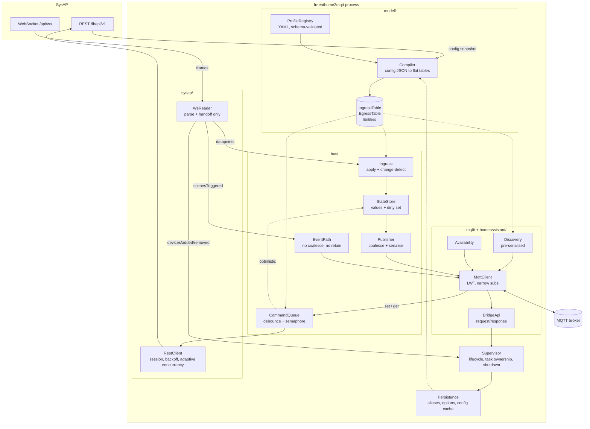
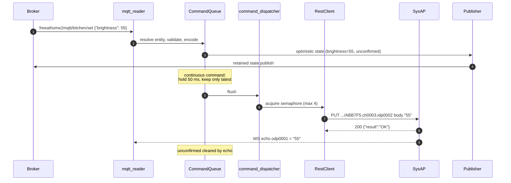

# 02 — Architecture

## 1. Component overview



## 2. Module layout

```
src/freeathome2mqtt/
├── __main__.py                 # python -m freeathome2mqtt
├── cli.py                      # arg parsing, config discovery, uvloop install
├── supervisor.py               # ADR-001 task ownership, startup order, shutdown
├── settings.py                 # pydantic config model + loader + env overrides
├── log.py                      # logging setup, MQTT log sink, redaction
│
├── sysap/
│   ├── rest.py                 # RestClient: session, auth, backoff, adaptive limiter
│   ├── ws.py                   # WsReader: connect, heartbeat, parse, hand off
│   ├── settings_probe.py       # unauthenticated /settings.json pre-flight
│   ├── mdns.py                 # optional zeroconf discovery of the SysAP
│   ├── schema.py               # TypedDicts for the config/WS JSON (no validation)
│   └── codes/                  # GENERATED — do not hand-edit
│       ├── pairings.py  functions.py  parameters.py  interfaces.py  NOTICE
│
├── model/
│   ├── entity.py               # Entity, AttributeSpec, CommandSpec (slots dataclasses)
│   ├── profiles.py             # profile loading, JSON-Schema validation, merge order
│   ├── codecs.py               # decode/encode primitives, registry
│   ├── transforms.py           # the named escape-hatch functions (ADR-003)
│   ├── compiler.py             # config JSON + profiles -> IngressTable/EgressTable/Entities
│   └── naming.py               # slugify, alias resolution, collision handling
│
├── profiles/                   # DATA. shipped, plus user profiles_dir merged over
│   ├── _schema.json
│   ├── lighting.yaml  covers.yaml  climate.yaml  sensors.yaml
│   ├── security.yaml  access.yaml  energy.yaml   inputs.yaml
│
├── bus/
│   ├── ingress.py              # WS datapoints -> StateStore; the hot path
│   ├── state.py                # values, dirty set, unconfirmed marks
│   ├── publisher.py            # coalescing loop, payload build, retained publish
│   ├── events.py               # edge events: buttons, scenes, doorbell
│   ├── commands.py             # /set and /get handling, debounce, dispatch
│   └── reconcile.py            # ADR-012 unconfirmed-command reconciliation
│
├── mqtt/
│   ├── client.py               # aiomqtt wrapper: LWT, narrow subscribe, republish
│   ├── topics.py               # every topic string is built here, nowhere else
│   └── bridge_api.py           # bridge/request/* handlers
│
├── homeassistant/
│   ├── discovery.py            # build + publish + retract discovery
│   └── components.py           # profile -> HA component mapping tables
│
├── availability.py             # bridge + per-device availability (ADR-008)
├── backoff.py                  # the one full-jitter delay every retrying link shares (docs/06 §3)
├── persistence.py              # entities.json, config cache, atomic writes
├── metrics.py                  # counters/histograms -> bridge/info + optional Prometheus
└── tools/
    ├── capture.py              # record a live SysAP into a test fixture (also wired to cli.py --capture)
    └── gen_codes.py            # regenerate sysap/codes/
```

Rules the layout enforces:

- **`mqtt/topics.py` is the only place a topic string is constructed.** Prevents the class of bug
  where one code path publishes to `.../availability` and another subscribes to `.../available`.
- **`sysap/` never imports from `mqtt/` and vice versa.** They meet in `bus/`. This keeps both
  independently testable against fakes.
- **`model/` is pure.** No I/O, no network, no clock. Given config JSON + profiles it produces
  tables deterministically. That makes the compiler exhaustively testable from fixtures, which is
  where most correctness risk lives.
- **`profiles/` contains no code.**
- **One backoff policy, in `backoff.py`.** docs/06 §3 defines a single full-jitter formula and
  then tabulates per-link constants; `sysap/rest.py`, `sysap/ws.py`, `mqtt/client.py` and
  `supervisor.py` all call the same `backoff_delay()` and differ only in the constants they pass,
  so the policy cannot drift between links.

## 3. Concurrency model

One event loop, a fixed set of long-lived tasks owned by the supervisor, and a small bounded pool
of ephemeral tasks for HTTP writes.

| Task | Cardinality | Responsibility | May block on |
|---|---|---|---|
| `ws_reader` | 1 | Receive frames, `orjson.loads`, dispatch by key. **Nothing else.** | Only the socket |
| `publisher` | 1 | Drain the dirty set, serialise, publish to MQTT | MQTT |
| `command_dispatcher` | 1 | Drain the debounce map, acquire the semaphore, spawn writes | Semaphore |
| `http_write` | ≤ `max_inflight` (4) | One `PUT` | SysAP |
| `mqtt_reader` | 1 | Receive subscribed messages, route to commands or bridge API | MQTT |
| `reconciler` | 1 | Expire unconfirmed marks, issue targeted reads | SysAP |
| `config_refresher` | 1 | Periodic + debounced config reload | SysAP |
| `availability` | 1 | Grace timers, per-device availability publishing | MQTT |
| `persistence` | 1 | Periodic atomic snapshot write | Executor |

**The cardinal rule:** `ws_reader` must never `await` anything that can take more than a few
milliseconds. It parses and hands off through in-memory structures. Every violation of this rule is
a dropped-events bug ([`docs/00 §7`](00-overview-and-decisions.md#7-what-performance-means-here-precisely)).

Because there is one loop and no threads, `StateStore` needs no locks. Any future temptation to add
a thread pool for "performance" must first prove the loop is CPU-saturated — it will not be.

### 3.1 Task supervision

The supervisor owns an `asyncio.TaskGroup`. Every long-lived task is wrapped in a
`restart_on_failure` shim that:

1. Catches everything except `asyncio.CancelledError`.
2. Logs with a full traceback and increments `task_restarts{task=...}`.
3. Sleeps with exponential backoff + jitter (1 s → 60 s).
4. Restarts.

A task that fails immediately five times in a row escalates: the bridge publishes
`bridge/state: offline`, logs a fatal, and exits non-zero so the container restarts. Silent
degradation — a dead publisher task while the process stays "up" — is worse than a crash.

## 4. The hot path, step by step

A single datapoint change, end to end. Annotated with complexity and allocation cost, because
this runs up to thousands of times a second in a burst.

```python
# 1. ws_reader — one orjson.loads per FRAME (not per datapoint)
frame = orjson.loads(msg.data)          # C, no Python-level parsing
body  = frame.get(sysap_uuid)
if body is None: ...                    # foreign UUID: count and drop
dps = body.get("datapoints")

# 2. ingress — per datapoint
for key, raw in dps.items():
    b = ingress.get(key)                # O(1) dict hit, no string ops
    if b is None:
        stats.unmapped += 1             # filtered-out channel; expected, cheap
        continue

    value = b.codec.decode(raw)         # small pure function, no regex, no format()

    if b.kind is EVENT:
        events.emit(b, value)           # separate path, no dedup, no retain
        continue

    slot = state.values[b.entity_idx]
    if slot[b.attr_idx] == value:       # CHANGE DETECTION — the cheapest win available
        continue
    slot[b.attr_idx] = value
    state.unconfirmed[b.entity_idx] &= ~b.attr_bit      # command confirmed by echo
    dirty.add(b.entity_idx)             # O(1), naturally deduplicating

if dirty:
    wake.set()                          # publisher is already waiting
```

```python
# 3. publisher — once per coalescing window
await wake.wait(); wake.clear()
if coalesce_ms:
    await asyncio.sleep(coalesce_ms / 1000)   # gather the rest of the burst
batch, dirty = dirty, set()

for idx in batch:
    e = entities[idx]
    payload = orjson.dumps(e.build_payload())        # dict comprehension over slots
    await mqtt.publish(e.state_topic, payload, qos=0, retain=True)
```

Properties worth stating explicitly:

- **No string parsing on the hot path.** The WS key is used verbatim as a dict key.
- **No pairing-ID scanning.** Resolved at compile time.
- **No topic formatting.** `e.state_topic` is a pre-built `str`.
- **No template rendering.** HA `value_template`s are part of the *discovery* payload, evaluated by
  Home Assistant, not by us.
- **Work is proportional to distinct entities changed**, not to events received.
- **Unchanged values cost one dict lookup, one decode, one comparison** and produce no traffic. In
  practice a large share of free@home frames are repeats (a sensor re-reporting the same value);
  change detection alone removes most of the publish volume.

## 5. The command path



Design points:

- **Validation happens before the optimistic publish.** An out-of-range or unknown attribute is
  rejected with a `bridge/response` error and never touches state.
- **Discrete vs continuous.** The profile declares `continuous: true` for brightness, position,
  setpoint, colour temperature — those are debounced. On/off, open/close/stop, lock/unlock go
  immediately. Debouncing an on/off would make the UI feel broken; not debouncing a slider melts
  the SysAP.
- **Debounce is leading-edge + trailing-edge**: send the first value immediately for
  responsiveness, then suppress until the window closes and send the final value. A slider drag
  therefore produces 2 writes, not 60 and not 1-arriving-late.
- **The semaphore is the real rate limiter.** Under overload, commands queue in the debounce map
  (where they continue to collapse) rather than piling into in-flight requests.
- **Failure is visible.** A failed write publishes an error to `bridge/response` (if the command
  carried a correlation id) *and* triggers immediate reconciliation so the retained state stops
  lying.

## 6. Control plane

`bridge/request/<command>` → handler → `bridge/response/<command>`. Requests may carry
`"transaction": "<id>"`, echoed in the response, so a caller can correlate.

Commands are listed in [`docs/04 §5`](04-mqtt-interface.md#5-the-bridge-api). Architecturally the
important part is that **the bridge API is the only mutation path for bridge-owned state** —
aliases, per-entity options, log level, reloads. Nothing else writes `entities.json`. That keeps the
persistence layer trivially correct and makes every mutation auditable through one code path.

## 7. Startup order

The ordering is load-bearing; getting it wrong loses events or produces a burst of "unavailable"
entities in Home Assistant. Full sequence diagram in [`docs/08 §1`](08-workflows.md#1-cold-start).

1. Parse config, install `uvloop`, set up logging.
2. **Probe** `GET /settings.json` — version gate, resolve the installation serial.
3. **Connect MQTT.** With LWT armed *before* anything can fail, so a subsequent crash is visible to
   consumers. Publish nothing yet.
4. **Open the WebSocket and start buffering.** ⚠ **Before** fetching the configuration.
5. **Fetch the configuration** and compile the tables.
6. **Apply the buffer** on top of the compiled state, then switch to live dispatch.
7. Publish HA discovery (retained), then all entity state (retained), then
   `bridge/state: online`.
8. Start the remaining tasks.

Step 4-before-5 is the subtle one. If you fetch the config first and then connect the WebSocket, any
change occurring in that window — hundreds of milliseconds on a large install — is lost forever,
because the WebSocket only reports changes going forward and nothing will re-read that datapoint
until something else touches it. Both reference implementations have this race. Buffering first
closes it: the buffer holds at most a few frames, and applying them after compile is idempotent.

The buffer is bounded (default 10 000 datapoint entries). If it overflows, the load is restarted
rather than continuing with a partial picture.

## 8. Shutdown

On `SIGTERM`/`SIGINT`:

1. Stop accepting new commands; cancel `mqtt_reader`.
2. Flush the command debounce map — a value the user just set must not be silently dropped.
   Bounded by a 2 s deadline.
3. Flush the publisher's dirty set.
4. Publish `bridge/state: offline` (retained, QoS 1) — an explicit offline is better than relying on
   the LWT, which only fires after the broker's keepalive timeout.
5. Stop virtual-device TTL keepalives.
6. Write the persistence snapshot.
7. Close the WebSocket, the HTTP session, then MQTT.

Total shutdown budget: 5 s, then hard exit. A container orchestrator will `SIGKILL` at 10 s and a
half-written state file is worse than a lost one — hence atomic writes (`write` to a temp file in
the same directory, `fsync`, `os.replace`).
