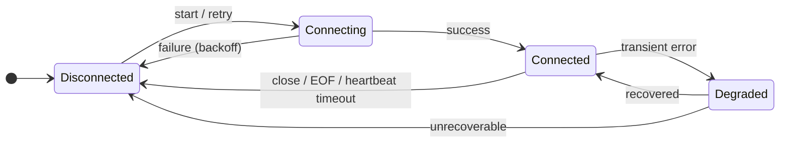
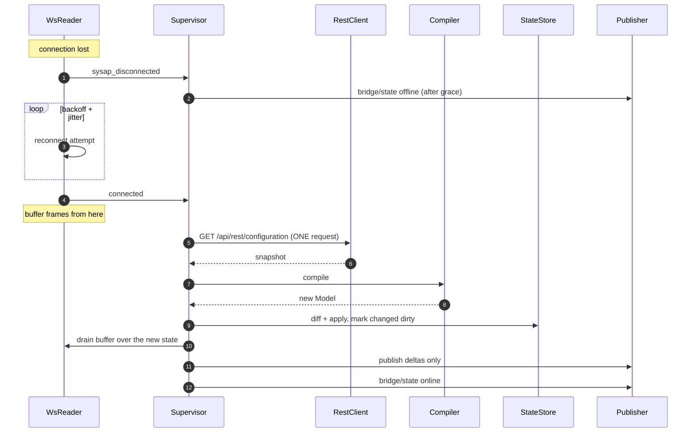

# 06 — Resilience, Availability & Recovery

A bridge is judged on what it does when something breaks, not on its happy path. The failure modes
here are specific: an embedded access point that reboots for firmware updates, a WebSocket with no
heartbeat, and a broker that may or may not persist retained messages.

## 1. Two independent links



Both the SysAP link and the MQTT link run this machine independently. `bridge/state` is a function
of both plus the load state ([ADR-008](00-overview-and-decisions.md#adr-008)):

```python
online = mqtt.connected and sysap_ws.connected and model_loaded
```

with a `grace_seconds` (default 10) hold-down before flipping to `offline`, so a 2-second reconnect
does not mark every entity in Home Assistant unavailable and then available again — which fires
`state_changed` twice for every entity and pollutes the recorder database.

## 2. The heartbeat, again

The SysAP sends no application-level keepalive on the WebSocket. Without protocol-level ping/pong, a
connection killed by an intermediate NAT, a Wi-Fi handover or a SysAP crash is **indistinguishable
from an idle one**. The bridge keeps reporting `online`, every retained value is frozen at whatever
it was, and nothing in the logs indicates a problem. Users describe this as "it worked for three
days then stopped".

```python
ws = await session.ws_connect(url, headers=auth, heartbeat=30, ssl=ssl_ctx)
```

`heartbeat=30` makes aiohttp send a PING every 30 s and close the connection if no PONG arrives
within the timeout. That close raises through `ws.receive()` and drives the reconnect. Additionally,
a **watchdog** independent of aiohttp: if no frame of any kind (including pongs) has been observed
for `ws_idle_timeout` (default 90 s), force-close and reconnect. Defence in depth, because this
failure is both the most likely and the most invisible.

## 3. Backoff policy

| Link / operation | Initial | Factor | Cap | Jitter | Give up? |
|---|---|---|---|---|---|
| SysAP WebSocket | 1 s | 2× | 60 s | ±25 % full jitter | Never |
| SysAP REST (`502`, connection error) | 0.5 s | 2× | 30 s | ±25 % | After 5 tries per request |
| MQTT | 1 s | 2× | 60 s | ±25 % | Never |
| Config reload | 2 s debounce | — | ≥ 30 s between | — | — |
| Auth failure (`401`/`403`) | — | — | — | — | **Immediately.** Do not retry. |

**Jitter is mandatory.** Multiple bridge instances, or a bridge plus the Home Assistant integration,
reconnecting in lockstep against a SysAP that has just rebooted will hold it down. Full jitter
(`sleep = random(0, backoff)`) is preferred over equal jitter for reconnects.

**Never retry authentication failures.** A retry loop against `401` will eventually trip the SysAP's
lockout and take out the user's app access too. Fail loudly, publish `bridge/state: offline`, log the
remedy, and exit non-zero.

**Adaptive concurrency on `502`.** A `502` means the device is saturated. Halve the effective
in-flight limit (floor 1), recover it by one on each subsequent success up to `max_inflight`. This
converts an outage into a slowdown, and it is the mechanism that keeps a `/get` storm or a burst of
commands from cascading into a WebSocket drop.

## 4. Resynchronisation

The correctness question after any gap: **what did we miss?** The WebSocket only reports changes
going forward, so anything that changed while disconnected is invisible, and — critically — nothing
will ever re-report it. A light switched at the wall during a 30-second reconnect stays wrong in
Home Assistant until someone touches it again.

The answer is [ADR-007](00-overview-and-decisions.md#adr-007): the configuration snapshot contains
every output's current value, so **one request** rebuilds complete truth.



Properties:

- **One HTTP request**, regardless of installation size (budget P8).
- **Buffer before fetch**, same as cold start ([`docs/02 §7`](02-architecture.md#7-startup-order)) —
  otherwise the same race reopens on every reconnect.
- **Publish only deltas.** A reconnect during which nothing changed produces zero MQTT messages.
  This matters: without it every WS blip republishes 1 000 retained messages and floods the broker.
- **Discovery is only republished if payloads changed** (byte comparison).
- Entities that disappeared from the config are retracted; new ones are discovered.

### 4.1 When to resync

| Trigger | Action |
|---|---|
| WebSocket reconnect after any gap | Full resync |
| `devices` / `devicesAdded` / `devicesRemoved` / `parameters` frame | Debounced full resync |
| `404` on a datapoint write | Debounced full resync (topology changed under us) |
| `bridge/request/reload` | Immediate resync |
| Periodic timer (`config_refresh_interval`, default 300 s) | Fetch + hash; resync only if the hash changed |
| Process start | Full load |

The periodic refresh exists mainly to pick up `unresponsive`/`defect` transitions, whose delivery
over the WebSocket is not fully confirmed (**⚠ verify empirically**, [`docs/01 §5.1`](01-freeathome-api.md#51-frame-schema)).
It costs one request every 5 minutes and, thanks to hashing, usually zero downstream work. If
empirical testing confirms `devices` frames carry `unresponsive` reliably, raise the default to
1800 s.

## 5. Availability

Three independent signals, deliberately not conflated.

### 5.1 Bridge availability — `<base>/bridge/state`

End-to-end health (§1). LWT-armed, retained, QoS 1. Every Home Assistant discovery payload lists it
first in `availability[]` with `availability_mode: all`.

### 5.2 Per-device availability — `<base>/<entity>/availability`

free@home gives this for free: `Device.unresponsive`, `unresponsiveCounter`, `defect`.

```json
{ "state": "offline", "reason": "unresponsive", "unresponsive_counter": 7 }
```

Published retained, QoS 1, only on change. Opt-in via `availability.per_device` (default `true`).
A battery-powered RF device that has dropped off the bus shows as unavailable in Home Assistant
instead of reporting a stale value forever — which no MQTT bridge for this system currently does.

### 5.3 Staleness — informational only

If an entity has published no change for `stale_after` (default: disabled), `bridge/info` counts it
as `counts.stale_entities`. The key is absent entirely when the feature is off, so a `0` always
means "measured, none stale" rather than "not measuring".
Deliberately **not** wired to availability: many free@home channels legitimately never change for
months (a garage door sensor, a rarely-used switch), and marking those unavailable would be wrong.
The counter exists so a user can spot a genuinely dead sensor; the judgement stays theirs.

## 6. Failure matrix

| # | Failure | Detection | Response | User-visible |
|---|---|---|---|---|
| F1 | SysAP rebooting (firmware update) | WS close, REST connection refused | Backoff + jitter; hold `bridge/state` for grace; resync on return | Entities unavailable ~2 min, then correct |
| F2 | WS silently dead (NAT/Wi-Fi) | `heartbeat=30` PONG timeout; 90 s idle watchdog | Force close, reconnect, resync | Brief unavailability |
| F3 | SysAP overloaded | `502` responses | Halve in-flight, backoff; commands stay queued in the debouncer | Slower commands, no data loss |
| F4 | Bad credentials | `401` | Retry once with `jid`; then fatal, `bridge/state: offline`, exit ≠ 0 | Clear log message with remedy |
| F5 | Local API turned off | `403` | Fatal with the activation instructions | Clear log message |
| F6 | Broker down | MQTT disconnect | Backoff; **keep ingesting** into state; publish deltas on reconnect | State correct on reconnect, no gap |
| F7 | Broker rejects an oversized packet | Publish error / MQTT 5 reason code | Split `bridge/devices` (§[`04 §4.3`](04-mqtt-interface.md#43-bridgedevices)); log | Inventory still published |
| F8 | Broker does not persist retained | Retained republish timer (2 s after connect) | Republish retained set once | Consumers see state |
| F9 | Device removed in the app | `devicesRemoved` frame | Retract discovery + retained topics; `bridge/event` | Entity disappears from HA cleanly |
| F10 | Device added in the app | `devicesAdded` frame | Debounced resync; discovery + state | Entity appears without a restart |
| F11 | Channel renamed in the app | `devices` frame → recompile | Topic changes; old retained cleared; discovery `unique_id` unchanged | HA entity keeps its identity and history |
| F12 | Datapoint write fails (`400`) | Non-OK result or status | No retry; error to `bridge/response`; immediate reconciliation | Optimistic value rolled back |
| F13 | Command sent, no echo | Reconciliation timer (3 s) | One targeted datapoint read; publish truth | State self-heals |
| F14 | Malformed value from a sensor | Codec exception | Return `null`, count `codec_errors`, WARNING once per entity | One attribute `null`, bridge unaffected |
| F15 | Unknown `functionID` | Compile-time no match | Channel skipped; listed in `bridge/devices` as unsupported | Discoverable, reportable |
| F16 | Config too large / parse failure | orjson error | Keep the previous model, retry with backoff, do not tear down | Bridge keeps running on last-known-good |
| F17 | Disk full / state file unwritable | Write error | Log; continue in memory; retry next interval | Aliases lost on restart, nothing else |
| F18 | Two bridges, one SysAP | — | Harmless for reads; writes may conflict | Documented; distinct client ids prevent broker eviction |
| F19 | A long-lived task dies | TaskGroup shim | Restart with backoff; escalate to process exit after 5 rapid failures | Container restarts rather than degrading silently |
| F20 | Clock jump (NTP sync, DST) | — | Use `time.monotonic()` for every timer and backoff | No stalled timers |

F6 is worth dwelling on: **losing the broker must not stop SysAP ingestion.** The state store keeps
absorbing changes; on reconnect, the dirty set holds exactly what changed and the bridge publishes
those and nothing else. The alternative — pausing ingestion — reopens the gap problem for the
duration of the broker outage.

F20 is easy to get wrong: every backoff, debounce, grace period and watchdog uses
`loop.time()`/`time.monotonic()`. Wall-clock timestamps appear only in payloads.

## 7. Startup failure handling

Startup is where the difference between a good and a bad operator experience is decided.

| Condition | Behaviour |
|---|---|
| `config.yaml` invalid | Exit 2 immediately with the pydantic error path. Never start with a partial config. |
| SysAP unreachable | Retry with backoff **indefinitely**; MQTT is connected and `bridge/state: offline` is published, so consumers see the truth. Do not exit — the SysAP may simply be booting alongside us. |
| SysAP version < 2.6.0 | Exit 3 with the upgrade requirement. |
| `401`/`403` | Exit 4 with the specific remedy (wrong password / Local API not activated). |
| Broker unreachable | Retry indefinitely. Log at WARNING every 30 s, not every attempt. |
| Zero entities compiled | Start anyway; publish `bridge/devices` so the user can see *why* (usually the orphan or interface filter). Log at WARNING with the counts. |
| Profile file invalid | Exit 5 naming the file and JSON-Schema error. A silently ignored broken profile is worse than a failed start. |

The distinction that matters: **configuration errors are fatal, environmental errors are retried.**
A wrong password should stop the process; an access point that is still booting should not.

## 8. Idempotency and ordering

- **State publishes are idempotent** — the full object, last-write-wins. Ordering between entities
  is irrelevant.
- **Commands are not idempotent** in general (a `trigger` fires each time). They are therefore never
  retried automatically after a transport success with a bad result; failures are surfaced, not
  re-sent.
- **Discovery is idempotent** — retained, byte-compared, republished only on change.
- **Retraction is idempotent** — an empty retained payload to a topic that has none is harmless.

## 9. Observability of failures

Every failure mode in §6 must be visible without attaching a debugger:

- A counter in `bridge/info.stats` (`reconnects_ws`, `command_errors`, `codec_errors`,
  `unmapped_datapoints`, `task_restarts`, `config_reloads`).
- A `bridge/event` for anything topological.
- A log line at the right level — **once**, not per occurrence, for repeating conditions. A
  `log_once(key)` helper keyed by `(logger, condition, entity)` prevents the log storms that make
  real problems invisible.
- Optional Prometheus endpoint (`metrics.enabled`, default `false`) exposing the same counters plus
  the latency histogram.

The acceptance test for this section is blunt: after inducing any failure from §6, a user should be
able to determine what happened from `bridge/info` and the last 50 log lines alone.
