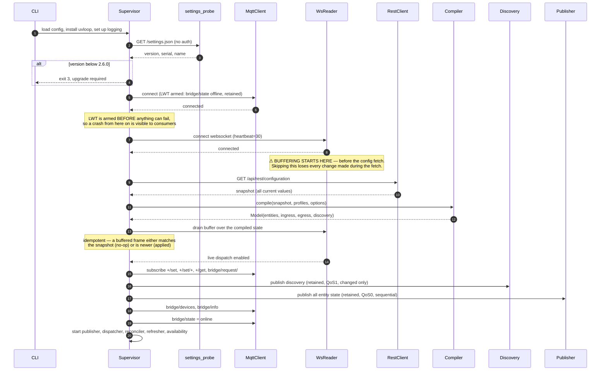
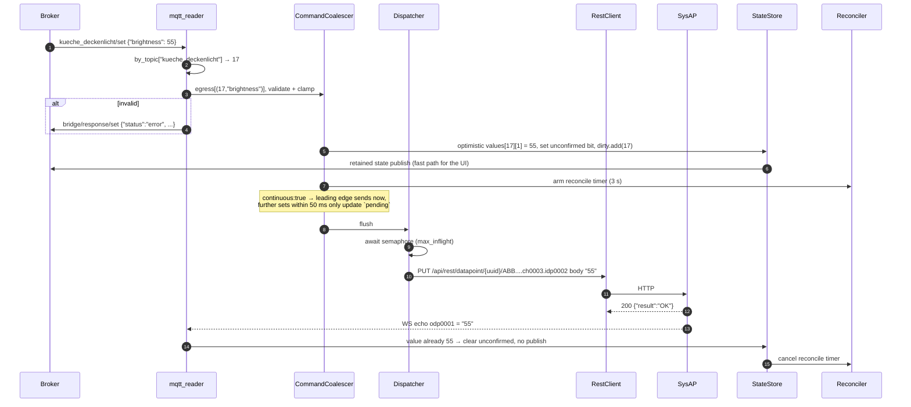
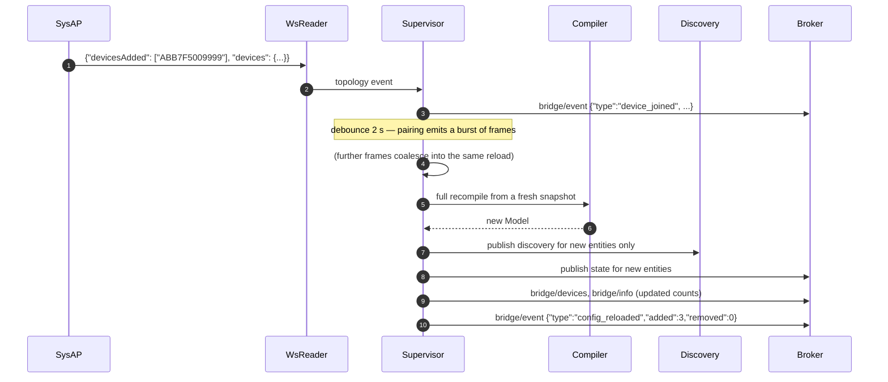
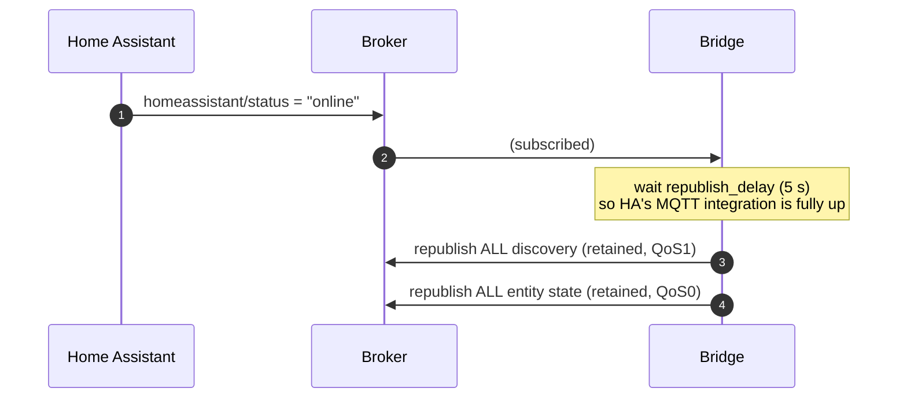
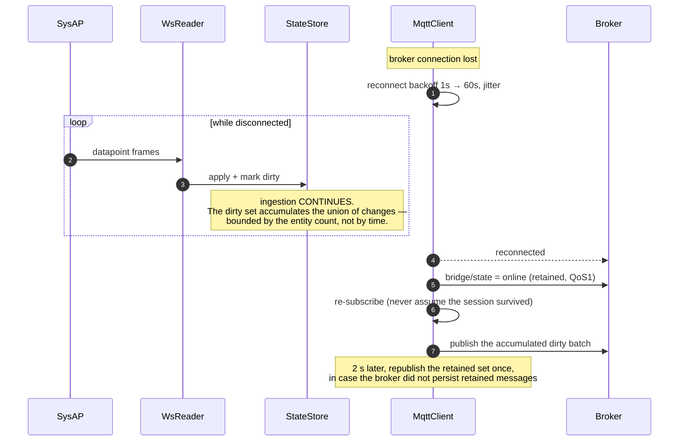
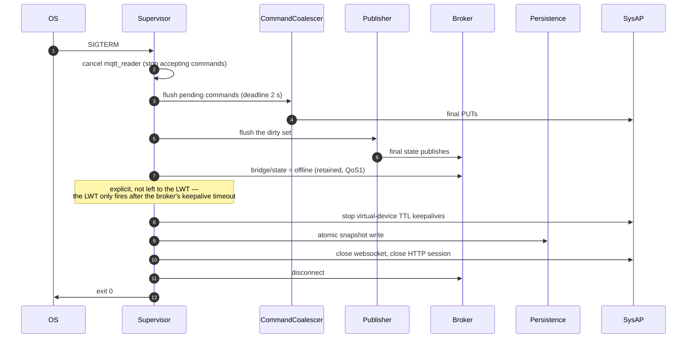

# 08 — Workflows

Sequence diagrams for every flow with non-obvious ordering. Where a step is load-bearing it is
called out, because these orderings are exactly where the reference implementations have bugs.

## 1. Cold start



**Steps 8–12 are the important ones.** Fetching the configuration before opening the WebSocket —
what both reference implementations do — creates a window of several hundred milliseconds during
which a change is lost permanently: the snapshot predates it and the WebSocket did not exist yet.
Nothing re-reads that datapoint until something else touches it, so a light switched at the wall
during startup stays wrong indefinitely.

**Steps 17–19 order matters too.** Discovery before state means Home Assistant has an entity to put
the state into. `bridge/state: online` last means consumers never act on a half-populated tree.

## 2. Datapoint event (the hot path)

```mermaid
sequenceDiagram
    autonumber
    participant S as SysAP
    participant W as WsReader
    participant I as Ingress
    participant ST as StateStore
    participant P as Publisher
    participant B as Broker

    S->>W: {sysap-uuid: {datapoints: {"ABB..../ch0003/odp0001": "60"}}}
    W->>W: orjson.loads (once per frame)
    W->>I: dispatch datapoints dict
    I->>I: ingress["ABB..../ch0003/odp0001"] → Binding(17, 1, decode_percent, STATE)
    I->>I: decode "60" → 60
    I->>ST: values[17][1] == 43 ? no → store
    ST->>ST: clear unconfirmed bit, dirty.add(17)
    ST->>P: wake.set()
    Note over P: sleep(coalesce_ms) — gather the rest of the burst
    P->>P: batch = dirty; dirty = set()
    P->>B: freeathome2mqtt/kueche_deckenlicht<br/>{"id":"ABB..._ch0003","state":true,"brightness":60}<br/>retained, QoS0
```

If `values[17][1] == 60` already, the flow stops at step 5: no dirty mark, no publish, no broker
traffic. That early return is the highest-leverage line in the codebase
([`docs/05 §1`](05-performance.md#1-budgets), budget P12).

## 3. Command



Failure branches:

- `result != "OK"` or HTTP `4xx` → error to `bridge/response/set`, reconcile **immediately** rather
  than after the timer, so the optimistic lie is corrected within one round trip.
- No echo before the timer fires → one targeted `GET /api/rest/datapoint/...`, publish the truth
  (possibly rolling back the optimistic value).
- `404` → the topology changed; additionally schedule a debounced config reload.

## 4. Reconnect and resync

```mermaid
sequenceDiagram
    autonumber
    participant W as WsReader
    participant SUP as Supervisor
    participant A as Availability
    participant B as Broker
    participant R as RestClient
    participant C as Compiler
    participant ST as StateStore
    participant P as Publisher

    Note over W: heartbeat timeout OR close frame OR idle watchdog
    W->>SUP: sysap_disconnected
    SUP->>A: start grace timer (10 s)
    Note over A: a fast reconnect never reaches the broker —<br/>no HA availability flap
    A->>B: bridge/state = offline   (only if grace expires)

    loop backoff 1s → 60s, full jitter
        W->>W: ws_connect
    end
    W-->>SUP: connected
    Note over W: ⚠ buffer frames from here, same as cold start

    SUP->>R: GET /api/rest/configuration      (exactly ONE request)
    R-->>SUP: snapshot
    SUP->>SUP: hash; unchanged? skip discovery entirely
    SUP->>C: compile
    C-->>SUP: new Model
    SUP->>ST: diff old vs new; mark only changed entities dirty
    SUP->>W: drain buffer
    SUP->>P: publish deltas only
    SUP->>A: bridge/state = online
```

If nothing changed while disconnected, this publishes **zero** entity messages. Republishing 1 000
retained messages on every WebSocket blip is a real and common bridge failure that floods brokers
and, with Home Assistant's recorder, writes thousands of pointless database rows.

## 5. Device added in the free@home app



The device appears in Home Assistant **without a restart**. Neither reference implementation does
this — both only handle the `datapoints` key — and it is one of the most visible differentiators.

## 6. Device removed

```mermaid
sequenceDiagram
    autonumber
    participant S as SysAP
    participant SUP as Supervisor
    participant B as Broker

    S->>SUP: {"devicesRemoved": ["ABB7F5001234"]}
    SUP->>SUP: debounced recompile; diff finds 4 entities gone
    loop for each removed entity
        SUP->>B: base/entity              "" retained   (clear state)
        SUP->>B: base/entity/availability "" retained
        SUP->>B: homeassistant/.../config    "" retained   (retract discovery)
    end
    SUP->>B: bridge/event {"type":"device_leave","serial":"ABB7F5001234"}
    SUP->>B: bridge/devices (updated)
```

Retraction is what stops entities accumulating in Home Assistant forever. Without the empty retained
payload, HA re-creates the entity from the broker on every restart, and the user has no way to get
rid of it except by manually clearing retained topics.

## 7. Rename

```mermaid
sequenceDiagram
    autonumber
    participant U as User
    participant B as Broker
    participant API as BridgeApi
    participant PS as Persistence
    participant HA as Discovery
    participant P as Publisher

    U->>B: bridge/request/entity/rename<br/>{"id":"ABB..._ch0003","name":"Kitchen Ceiling"}
    B->>API: handle
    API->>API: slug → "kitchen_ceiling"; check collisions
    API->>B: old state topic       "" retained
    API->>B: old availability      "" retained
    API->>B: old discovery topics  "" retained
    API->>PS: entities.json: alias = "kitchen_ceiling"
    API->>API: rebuild the entity's topics; by_topic remap
    API->>HA: republish discovery (unique_id UNCHANGED)
    API->>P: republish state on the new topic
    API->>B: bridge/event {"type":"entity_renamed","from":...,"to":...,"id":...}
    API->>B: bridge/response/entity/rename {"status":"ok"}
```

Because `unique_id` is the immutable entity id and not the name
([ADR-010](00-overview-and-decisions.md#adr-010)), Home Assistant **updates** the existing entity
rather than creating a duplicate. History, automations and the entity registry entry all survive the
rename. This is the concrete payoff for separating identity from naming.

## 8. Home Assistant restart



The delay is not cosmetic: publishing discovery into an HA instance whose MQTT integration is still
loading gets it silently dropped, and the user sees a permanently empty integration.

Note this is a **full** republish, ignoring the changed-only optimisation, because HA may have
purged its own discovery cache and the broker's retained state may not be trusted.

## 9. Broker outage



Two design consequences worth stating:

- **Ingestion never pauses.** The dirty set's size is bounded by the number of entities, so a
  ten-hour broker outage costs the same memory as a ten-second one, and the bridge is instantly
  correct on reconnect.
- **Always re-subscribe on connect.** Whether the broker preserved the session depends on
  `clean_session`, broker configuration and MQTT version. Re-subscribing is idempotent and cheap;
  assuming persistence and being wrong means the bridge silently stops accepting commands.

## 10. Graceful shutdown



Total budget 5 s, then hard exit. Flushing pending commands first matters: a user who moved a slider
and immediately restarted the container should not lose that command, and the debouncer is exactly
where it would be sitting.
