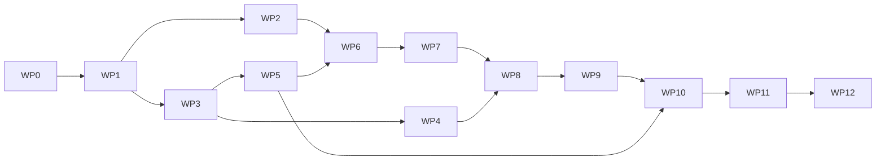

# 11 — Implementation Plan

Twelve work packages, ordered by dependency. Each is sized to be completable and reviewable on its
own, and each has acceptance criteria that are objectively checkable. An implementing agent should
work them in order, and should not start a package until its predecessors' acceptance criteria pass.

**Global definition of done**, applied to every WP:

- `ruff check`, `ruff format --check`, `mypy --strict` clean.
- Tests added for the package's own behaviour, and every pitfall listed in its "Closes" row has its
  named test from [`docs/09`](09-pitfalls.md).
- Public functions have docstrings; non-obvious decisions carry a `# see docs/NN §M` reference.
- Documentation updated where the implementation revealed the plan was wrong. **The plan is not
  sacred — if reality disagrees with a document, change the document in the same commit and say why.**

---

## WP0 — Bootstrap

**Deliverables**
- `pyproject.toml` (hatchling, Python ≥ 3.12, deps: `aiohttp`, `aiomqtt`, `orjson`, `uvloop`,
  `pydantic`, `pyyaml`, `jsonschema`; dev: `pytest`, `pytest-asyncio`, `pytest-cov`,
  `pytest-benchmark`, `hypothesis`, `ruff`, `mypy`, `testcontainers`).
- `ruff.toml` with `G004` (no f-strings in logging) enabled — this is a performance rule (P-50), not
  style.
- `mypy` strict config; `pytest` config with markers `bench`, `soak`, `integration`.
- Package skeleton per [`docs/02 §2`](02-architecture.md#2-module-layout), every module a stub with
  its docstring stating its responsibility.
- CI workflow: lint, type, test, coverage.
- **Licence decision** ([ADR-002](00-overview-and-decisions.md#adr-002), P-58). Determine the terms
  of `Busch-Jaeger/node-free-at-home` and `local-abbfreeathome`, choose this project's licence, write
  `LICENSE` and the plan for `sysap/codes/NOTICE`. **Blocking for WP1** — do not commit a generated
  table before this is settled.

**Acceptance** `uv run pytest` passes on an empty suite; CI green; `LICENSE` present; the licence
question is answered in writing.

---

## WP1 — Domain codes and the capture tool

**Deliverables**
- `tools/gen_codes.py` → `sysap/codes/{pairings,functions,parameters,interfaces}.py` + `NOTICE`.
  `IntEnum`, idempotent, `--check` mode for CI.
- `sysap/settings_probe.py` — unauthenticated `/settings.json`, version gate, serial, `jid` fallback.
- `sysap/schema.py` — `TypedDict`s for the configuration and WS frame per
  [`docs/01 §4`](01-freeathome-api.md#4-configuration-schema) and [`§5.1`](01-freeathome-api.md#51-frame-schema).
- `tools/capture.py` — record + pseudonymise ([`docs/10 §3.3`](10-testing.md#33-the-capture-tool)).
- Fixtures `minimal.json`, `typical.json`, `nasty.json`.

**Acceptance** `gen_codes.py --check` byte-identical in CI; `test_capture_contains_no_identifying_data`
passes; version gate rejects `2.5.9` and accepts `2.6.0`.

**Closes** P-06, P-58

---

## WP2 — SysAP client

**Deliverables**
- `sysap/rest.py` — one `ClientSession`, Basic auth, SSL modes (verify / CA file / off), typed
  errors per [`docs/01 §2.3`](01-freeathome-api.md#23-error-codes), retry **only** `502` and
  connection errors, exponential backoff with full jitter, `asyncio.Semaphore(max_inflight)`,
  adaptive concurrency reduction on `502`, `result != "OK"` treated as failure.
- `sysap/ws.py` — connect with `heartbeat=30`, 90 s idle watchdog, backoff+jitter reconnect, frame
  parse with `orjson`, UUID check, dispatch by frame key, **buffer mode** for startup and resync.
- `tests/fakes/fake_sysap.py` with every capability in [`docs/10 §3.1`](10-testing.md#31-testsfakesfake_sysappy).

**Acceptance** `test_ws_reconnects_on_silence`, `test_auth_failure_is_not_retried`,
`test_sysap_502_reduces_concurrency`, `test_non_ok_result_is_a_failure`, `test_non_default_sysap_uuid`
all pass. The fake asserts concurrency never exceeds `max_inflight`.

**Closes** P-10, P-11, P-12, P-20, P-21, P-24

---

## WP3 — Model and compiler

**Deliverables**
- `model/entity.py`, `model/codecs.py` (full registry per [`docs/03 §5`](03-model-and-profiles.md#5-codecs)),
  `model/naming.py` (slugify + collisions), `model/profiles.py` (loader, JSON Schema, merge order),
  `profiles/_schema.json`.
- `model/compiler.py` — the pure `compile()` per [`docs/03 §4`](03-model-and-profiles.md#4-compilation),
  including the diff for reloads.
- Property tests per [`docs/10 §5`](10-testing.md#5-property-based-tests).

**Acceptance** `test_compiler_is_deterministic`, `test_all_codecs_map_empty_to_none`,
`test_slugify_german_umlauts`, `test_slug_collision_resolution_is_deterministic`,
`test_floorplan_null_rooms`, `test_placeholder_channel_names_fall_back`. Compiling `nasty.json`
produces no exception and a fully-populated `Model`. `bench_compile` meets budget P7.

**Closes** P-01, P-02, P-04, P-05, P-14, P-15, P-18, P-39, P-40, P-54

---

## WP4 — Tier-1 profiles

**Deliverables** All tier-1 profiles from [`docs/03 §9`](03-model-and-profiles.md#9-profile-coverage-targets),
each with a round-trip fixture. `model/transforms.py` with `room_temperature_controller` and
`cover_with_slats`.

**Acceptance** ≥ 85 % of channels in `typical.json` match a profile; the parametrised
`test_profile_wellformed` passes for all; `test_cover_position_inversion_roundtrip`,
`test_forced_position_roundtrip_asymmetric`, `test_color_temp_uses_channel_parameters`,
`test_brightness_zero_maps_to_off`.

**Closes** P-03, P-07, P-08, P-09

---

## WP5 — MQTT layer

**Deliverables**
- `mqtt/client.py` — LWT armed at connect, narrow subscriptions, re-subscribe on every connect,
  MQTT 5 with 3.1.1 fallback, client id `freeathome2mqtt_<serial>`, retained republish 2 s after
  connect, wildcard-topic assertion, per-topic last-published-bytes tracking.
- `mqtt/topics.py` — the sole source of topic strings.
- `bus/state.py`, `bus/publisher.py` — dirty set, coalescing loop, payload building.
- `bus/events.py` — the non-coalescing edge path.

**Acceptance** `test_bridge_subscribes_only_to_command_topics`, `test_resubscribe_after_reconnect`,
`test_events_are_not_retained`, `test_publish_rejects_wildcard_topics`,
`test_retained_republish_after_reconnect`, `test_client_id_includes_sysap_serial`.
`bench_dedup` (P12) and `bench_burst` (P4) meet budget.

**Closes** P-27, P-31, P-32, P-38, P-42, P-43, P-47, P-48

---

## WP6 — Ingress and the hot path

**Deliverables** `bus/ingress.py` per [`docs/02 §4`](02-architecture.md#4-the-hot-path-step-by-step),
observing rules R1–R7. `metrics.py` counters.

**Acceptance** `bench_latency` meets P1 and P2; `bench_ingest` meets P3; `test_ws_reader_never_awaits_io`
passes; unmapped datapoints are counted, not logged per occurrence.

**Closes** P-25, P-50

---

## WP7 — Commands, optimism, reconciliation

**Deliverables** `bus/commands.py` (object / attribute / scalar forms, validate-then-clamp,
leading+trailing debounce on `continuous`), `bus/reconcile.py`, `/get` with rate limiting.

**Acceptance** `bench_command_debounce` meets P5; `test_unconfirmed_command_is_reconciled`,
`test_command_failure_rolls_back`, `test_get_storm_is_rate_limited`.

**Closes** P-19, P-46, P-52, P-53

---

## WP8 — Supervisor, lifecycle, resilience

**Deliverables** `supervisor.py` — startup order per [`docs/02 §7`](02-architecture.md#7-startup-order)
including **WS-before-config buffering**, TaskGroup with restart shim and escalation, config reload
(debounced, rate-limited, diff-and-publish-deltas), periodic refresh with hashing, graceful shutdown,
`availability.py`, `persistence.py` with atomic writes and `entities.json` versioning.

**Acceptance** `test_no_events_lost_during_startup_window`, `test_resync_issues_exactly_one_request`,
`test_resync_publishes_only_deltas`, `test_devices_added_triggers_reload`,
`test_devices_removed_retracts_discovery`, `test_broker_outage_state_correct_on_reconnect`,
`test_shutdown_flushes_pending_commands`, `test_task_restart_and_escalation`,
`test_lwt_armed_before_sysap_connect`, `test_timers_use_monotonic_clock`. `bench_resync` meets P8.

**Closes** P-13, P-22, P-23, P-26, P-28, P-29, P-30, P-55

---

## WP9 — Bridge API and configuration

**Deliverables** `mqtt/bridge_api.py` (all commands in [`docs/04 §5`](04-mqtt-interface.md#5-the-bridge-api)),
`settings.py` (pydantic model, env overrides, `!env`/`!secret`/`!file`, semantic validation),
`log.py` (redaction, rate-limited MQTT sink, `log_once`), `cli.py` (`--check-config`, `--dry-run`,
`--discover`, `--capture`), `sysap/mdns.py`, virtual-device create + TTL keepalive.

**Acceptance** `test_no_secrets_in_logs_or_bridge_info`, `test_mqtt_log_sink_is_rate_limited`,
`test_rename_clears_old_retained_topics`, `test_virtual_device_ttl_keepalive`,
`test_reload_debounce_and_rate_limit`. `--dry-run` prints the entity table and publishes nothing —
verified by asserting zero broker messages.

**Closes** P-16, P-33, P-44, P-45

---

## WP10 — Home Assistant discovery

**Deliverables** `homeassistant/discovery.py` + `components.py` per
[`docs/04 §6`](04-mqtt-interface.md#6-home-assistant-discovery): pre-serialised payloads, changed-only
publishing backed by `discovery.json`, retraction, birth-message handling with delay, the
`discovery_topic != base_topic` guard, `bridge/devices` splitting.

**Acceptance** `test_unique_id_stable_across_rename`, `test_removed_entities_are_retracted`,
`test_ha_birth_republishes_after_delay`, `test_large_inventory_is_split`,
`test_initial_publish_is_sequential`. A restart with an unchanged installation publishes **zero**
discovery messages. `bench_startup` meets P6.

**Closes** P-34, P-35, P-36, P-37, P-41, P-49

---

## WP11 — Tier-2/3 profiles and raw mode

**Deliverables** Tier-2 and tier-3 profiles; remaining transforms; `raw_mode`
(`false | unsupported_only | true`); unsupported channels reported in `bridge/devices`.

**Acceptance** ≥ 85 % profile coverage against `captured/*.json`;
`test_unsupported_channels_are_reported`; `test_default_interface_filter_excludes_hue_sonos`.

**Closes** P-17, P-59

---

## WP12 — Release engineering

**Deliverables** Multi-arch Dockerfile (non-root, `--init`, health check), `docker-compose.example.yml`,
`config.example.yaml` fully commented, user documentation (install, configure, troubleshoot, "my
device isn't supported"), the soak test and its nightly workflow, benchmark baselines, release
automation, optional Prometheus endpoint, optional Home Assistant add-on wrapper.

**Acceptance** The container starts on `amd64`, `arm64` and `armv7`; a 24 h soak passes with < 10 %
RSS growth, zero unhandled exceptions and a final state matching ground truth; all budgets in
[`docs/05 §1`](05-performance.md#1-budgets) verified on the reference Pi 4.

**Closes** P-51 (via soak), P-60

---

## Dependency graph

WP3/WP4 (pure, offline) and WP2/WP5 (I/O, needs fakes) can proceed in parallel after WP1.

## Milestones

| Milestone | Packages | What works |
|---|---|---|
| **M1 — Walking skeleton** | WP0–WP2 | Connects, fetches config, prints devices. Nothing published. |
| **M2 — Read-only bridge** | + WP3, WP4, WP5, WP6 | Live state on MQTT for tier-1 profiles. Genuinely useful already. |
| **M3 — Bidirectional** | + WP7 | Commands work, with optimism and reconciliation. |
| **M4 — Production shape** | + WP8, WP9 | Survives failures; bridge API; real configuration. |
| **M5 — Home Assistant** | + WP10 | Zero-configuration HA integration. |
| **M6 — 1.0** | + WP11, WP12 | Full coverage, containers, soak-verified. |

M2 is the point at which the project should be shared for feedback: a read-only bridge is safe to
run against someone else's house, and real captures from early users are the highest-value input for
WP4 and WP11.

## Guidance for the implementing agent

1. **Start each package by writing the acceptance tests.** They are specified above; the fake SysAP
   from WP2 makes almost all of them cheap.
2. **Never copy reference-implementation structure**, only its domain knowledge. The anti-pattern
   table in [`docs/05 §7`](05-performance.md#7-anti-patterns--explicitly-do-not-do-these) names
   exactly what not to bring across (P-57).
3. **Do not optimise before WP6's benchmarks exist.** The budgets are the authority; guesses are not.
   Equally: do not violate rules R1–R10 "temporarily" — those are architectural, not tuning.
4. **When reality contradicts these documents, change them.** Especially every
   **⚠ verify empirically** marker in [`docs/01`](01-freeathome-api.md) and the open questions in
   [`docs/10 §10`](10-testing.md#10-manual-verification-against-real-hardware). A wrong document that
   nobody corrects is worse than no document.
5. **Keep `model/` pure.** The moment it needs a clock, a socket or a global, the test strategy
   collapses. If something seems to need it, the something belongs in `bus/` or `supervisor.py`.
6. **Profiles are data.** If a device type seems to need code, first check whether a codec or a
   `requires` discriminator solves it. A transform is the last resort, and the list in
   [`docs/03 §7`](03-model-and-profiles.md#7-complex-profiles-and-the-transform-escape-hatch) should
   not grow much.
