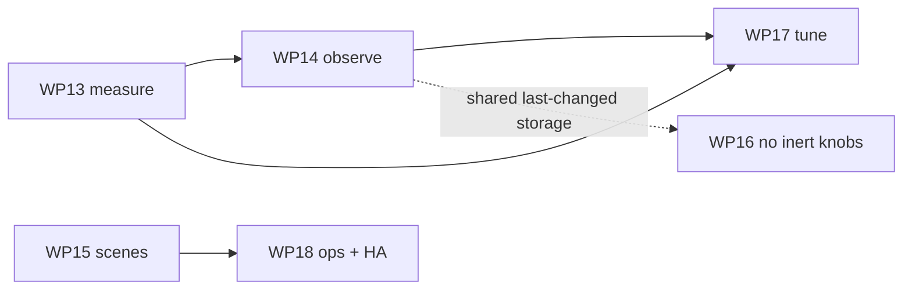

# 12 — Quality of Life & Performance

[`docs/11`](11-implementation-plan.md) planned twelve work packages and all twelve landed. This is
the follow-on plan: six packages in the same shape (**Deliverables** / **Acceptance** / **Closes**),
under the same global definition of done as [`docs/11`](11-implementation-plan.md), ordered so each
is justified by evidence the previous one produced.

Nothing here is speculative. Every item is one of:

- **(a)** a budget this project already committed to and does not yet measure,
- **(b)** a behaviour a document specifies and the code does not implement, or
- **(c)** a `config.yaml` knob the schema accepts, validates, and nothing acts on.

[§11](#11-considered-and-not-proposed) lists what was considered and deliberately *not* proposed, so
the omissions are as visible as the inclusions. [§10](#10-decisions-this-plan-does-not-take) lists
the four questions that need a maintainer's call before the code that depends on them is written.

---

## 1. Where the project actually stands

### 1.1 Two of the twelve budgets have never been measured

[`docs/05 §1`](05-performance.md#1-budgets) lists twelve budgets and names the benchmark that
enforces each. `tests/bench/` holds seven modules carrying eight bench tests
(`test_bench_publisher.py` carries two); together with the fake SysAP's own assertion for P11, ten
of the twelve budgets are gated.

| # | Budget | Benchmark named in [`docs/05 §8`](05-performance.md#8-benchmarks) | State |
|---|---|---|---|
| P1, P2 | Latency p99 ≤ 50 ms / ≤ 10 ms | `bench_latency` | `tests/bench/test_bench_latency.py` |
| P3 | ≥ 5 000 datapoints/s | `bench_ingest` | `tests/bench/test_bench_ingest.py` |
| P4 | Scene burst → ≤ 40 publishes | `bench_burst` | `tests/bench/test_bench_publisher.py` |
| P5 | 60 `/set` → ≤ 6 writes | `bench_command_debounce` | `tests/bench/test_bench_command_debounce.py` |
| P6, P7 | Cold start ≤ 3 s / compile ≤ 400 ms | `bench_startup`, `bench_compile` | two modules |
| P8 | Resync ≤ 1.5 s, 1 request | `bench_resync` | `tests/bench/test_bench_resync.py` |
| P11 | Concurrent SysAP requests ≤ `max_inflight` | asserted in the fake SysAP | `tests/fakes/fake_sysap.py` |
| P12 | Unchanged-value frames → 0 publishes | `bench_dedup` | `tests/bench/test_bench_publisher.py` |
| **P9** | **RSS ≤ 120 MB at 1 000 entities** | **`bench_memory`** | **no such module** |
| **P10** | **Idle CPU ≤ 0.5 % of one core** | **`bench_idle`** | **no such module** |

`tests/test_soak.py` (WP12) asserts < 10 % RSS *growth* over the soak window, which is a different
property from the absolute P9 ceiling and is not run at 1 000 entities. Idle CPU is asserted
nowhere at all. Both are load-bearing claims — each is one of the eight goals in
[`docs/00 §2`](00-overview-and-decisions.md#2-goals) ("< 120 MB RSS at 1 000 channels; idle CPU
< 0.5 % of one core") — and neither is verified anywhere in the suite.

### 1.2 Relative regression gating covers one benchmark of eight

`bench/baseline.json` contains exactly one entry,
`test_bench_compile_1000_channels_meets_p7_budget`, so `tools/compare_bench.py` gates exactly one
of the eight bench tests — the only synchronous, CPU-bound one, and so the only one that uses
`pytest-benchmark`'s `benchmark` fixture. [`docs/10 §7`](10-testing.md#7-benchmarks) already states
this and names extending it as a tracked future improvement — WP13 is that improvement.

The seven async tests do still assert their absolute
[`docs/05 §1`](05-performance.md#1-budgets) budgets on every merge to `main` via CI's `bench` job.
What is missing is the *relative* gate: a change that leaves a benchmark inside its absolute budget
while making it 3× slower passes today.

### 1.3 Documented behaviour that is not implemented

| Behaviour | Specified in | State in code |
|---|---|---|
| `scenesTriggered` frames publish events **and** apply to state | [`docs/01 §5.1`](01-freeathome-api.md#51-frame-schema) | `Ingress.process_frame` reads only `body["datapoints"]`; no other call site handles the key. Frames are silently dropped. Recorded as unresolved in `PLAN-REVIEW.md` (C6). |
| `bridge/info.stats` carries `ws_frames`, `state_publishes`, `commands`, `command_errors`, `latency_ms` | [`docs/04 §4.2`](04-mqtt-interface.md#42-bridgeinfo) | `Metrics` has six counters; none of these five. Named as a gap in `supervisor._build_bridge_info`'s own docstring. |
| A `404` on a datapoint write triggers a debounced resync | [`docs/06 §4.1`](06-resilience.md#41-when-to-resync) | Not wired. Named as a gap in `supervisor.py`'s module docstring. |
| A `--health` flag / a healthcheck that probes the *running* bridge | `PLAN-REVIEW.md` B3 (proposed, never added — [`docs/07 §3`](07-configuration.md#3-cli) still lists four flags without it) | `cli.py` has four modes, none of them `--health`; the container `HEALTHCHECK` runs `--check-config`, which parses a file and asks the running process nothing. |
| Home Assistant add-on wrapper | [`docs/07 §5.3`](07-configuration.md#53-home-assistant-add-on) | Not built. Named in `.github/workflows/release.yml`'s header comment as an optional WP12 deliverable that was not attempted. |
| A `preset_mode` axis for the room controller's `eco` | `homeassistant/components.py` §docstring | `eco` maps onto HA's `auto` — a documented simplification, named not silently taken. |

### 1.4 Config knobs accepted, validated, and inert

Each is listed in `settings.py`'s module docstring as a deliberate named gap rather than a silent
drop, which is the right discipline — but a user who sets one today gets neither an error nor the
behaviour.

| Knob | Documented in | Why it is still inert |
|---|---|---|
| `entities.exclude` / `include` | [`docs/07 §2`](07-configuration.md#2-configyaml) | Not enforced by `model/compiler.py`. |
| `availability.stale_after` | [`docs/06 §5.3`](06-resilience.md#53-staleness--informational-only) | Needs a per-entity last-changed timestamp — new state, not just wiring. |
| `advanced.log_to_mqtt` | [`docs/04 §4.5`](04-mqtt-interface.md#45-bridgelogging) | `log.MqttLogHandler` is implemented and tested standalone; `Supervisor` exposes no hook to attach it once its `MqttClient` connects. |
| `advanced.cache_config` | [`docs/05 §5`](05-performance.md#5-startup-optimisation) | Deferred in `persistence.py` rather than built ahead of a caller. |
| `performance.coalesce_adaptive` (+ `coalesce_max_ms`, `coalesce_burst_threshold`) | [`docs/05 §4.1`](05-performance.md#41-state-publishing) | The document's own precondition — "implement it only after P1–P4 pass without it" — is now met. |
| `mqtt.cert` / `mqtt.key` | [`docs/07 §2`](07-configuration.md#2-configyaml) | Client-certificate auth not plumbed into an `SSLContext`; named in `settings._build_mqtt_tls`. |
| `mqtt.version` | [`docs/04 §8`](04-mqtt-interface.md#8-compatibility-notes) | Blocked on an upstream `paho-mqtt` / `aiomqtt` defect, reproduced in isolation. |
| `homeassistant.legacy_entity_attributes` | [`docs/07 §2`](07-configuration.md#2-configyaml) | Its payload shape is not specified anywhere in [`docs/04 §6`](04-mqtt-interface.md#6-home-assistant-discovery). |

---

## 2. Ordering principle

**Measure, then observe, then correct, then extend.**

[`docs/05 §2`](05-performance.md#2-where-the-time-actually-goes) concludes that this bridge is
"broker-bound and SysAP-bound, never CPU-bound", and
[`docs/11`](11-implementation-plan.md#guidance-for-the-implementing-agent)'s guidance #3 says not to
optimise before the benchmarks exist. Both point the same way: a performance package that is not
preceded by a measurement is a guess, and this codebase has a good record of not guessing.

So WP13 closes the measurement gap, WP14 makes the running bridge report the same numbers the
benchmarks assert, and only then do WP17's two optimisations get evaluated — with the explicit
option of deleting a knob rather than implementing it, if the numbers say it buys nothing.

WP15 and WP16 are correctness and contract work, independent of the measurement chain, and can run
in parallel with it.

---

## 3. WP13 — Measure what is already claimed

> **Landed.** `bench_memory` and `bench_idle` exist; `tools/compare_bench.py` gates five
> benchmarks instead of one. Measured: **48.6 MB** RSS at 1 000 entities (P9 budget 120 MB) and
> **0.04 %** of one core at idle (P10 budget 0.5 %). See [§3.1](#31-what-the-measurements-showed).

**Why now** Two budgets ([§1.1](#11-two-of-the-twelve-budgets-have-never-been-measured)) have no
benchmark, and the relative-regression gate covers one of the eight bench tests
([§1.2](#12-relative-regression-gating-covers-one-benchmark-of-eight)). Everything downstream in
this plan claims a performance effect; none of it can be argued without this first.

**Deliverables**

- `tests/bench/test_bench_memory.py` — P9. A 1 000-entity model under steady traffic; RSS read from
  `/proc/self/status`'s live `VmRSS` line, the technique `tests/test_soak.py` already uses in
  preference to `ru_maxrss`'s monotonic peak. Asserts the absolute ceiling **and** the absence of a
  growth trend across the window, with `tracemalloc` snapshots diffed by allocation site so a
  failure names the offending call rather than just the number
  ([`docs/05 §9`](05-performance.md#9-profiling-recipe) step 3).
- `tests/bench/test_bench_idle.py` — P10. `resource.getrusage(RUSAGE_SELF)` user+sys CPU delta over
  a quiet window at 0.1 events/s, asserted as a fraction of elapsed wall time.
- `tests/bench/_record.py` — a small timer wrapper that writes `pytest-benchmark`-shaped entries into
  `bench/results.json` for the seven async tests, so `tools/compare_bench.py` gates them
  relatively as well as absolutely. Hand-rolled rather than adding a dependency, exactly as
  [`docs/10 §7`](10-testing.md#7-benchmarks) proposes.
- A regenerated `bench/baseline.json`, produced **on the CI runner**, not on a developer machine:
  the gate is relative and baselines are machine-specific.

**On the absolute numbers.** P9 and P10 are Raspberry Pi 4 budgets
([`docs/05 §1`](05-performance.md#1-budgets)). A GitHub-hosted runner is a different machine with a
different interpreter footprint, so these two tests assert a headroom-adjusted ceiling in CI and
record the measured value for the relative gate, while the authoritative absolute check stays where
[`docs/10 §7`](10-testing.md#7-benchmarks) already puts it — on the reference Pi 4, before a
release. Stating that up front is the difference between a meaningful gate and a flaky one.

**Timing deviation, named** [`docs/05 §8`](05-performance.md#8-benchmarks) specifies a 10-minute
window for both `bench_memory` and `bench_idle`. The per-PR runs use a shorter one, with the full-length form belonging to the nightly soak workflow — the same documented
deviation `bench_ingest` (WP6) and `bench_resync` (WP8) already took, for the same reason.

**Acceptance** `test_bench_memory_rss_within_budget` (P9) · `test_bench_idle_cpu_within_budget`
(P10) · `test_compare_bench_detects_async_regression` — feed `compare_bench.py` a synthetic
`results.json` 40 % slower than the baseline on an async benchmark and require a non-zero exit,
which is the assertion that proves the new entries are actually gated and not merely recorded.

**Closes** The `bench_memory` / `bench_idle` rows of
[`docs/05 §8`](05-performance.md#8-benchmarks); [`docs/10 §7`](10-testing.md#7-benchmarks)'s tracked
improvement.

**Size** S.

### 3.1 What the measurements showed

Three things came out of actually running this that the plan could only guess at.

**The memory budget passes with room to spare, and docs/05 §6's estimate was right.** 48.6 MB RSS
at 1 000 entities in a clean interpreter, of which ~6.6 MB is the compiled model itself — against
§6's predicted ~6 MB for the `Entity` objects, ingress dict, values and discovery payloads
combined. At the 2 500-channel stress target it is 58.8 MB. The Python baseline dominates, exactly
as §6 says it does.

**Not every measurement can carry a relative gate.** Across five full bench runs, four async
measurements were stable to within 0–7 % run to run (`p1_p99`, `p2_p99`, `rss_kib`,
`cold_start`) and three were not (`drain_tail` up to 444 %, `resync` up to 96 %, `cpu_fraction` up
to 34 %). All three unstable ones are measurements whose absolute value is tiny — milliseconds, or
a 0.0003 CPU fraction — so run-to-run jitter swamps any real change. Gating them would have bought
a flaky CI job rather than a safety net, so the baseline carries the four stable ones plus
`bench_compile`, and `compare_bench.py` prints how many recorded benchmarks are *not* gated so the
distinction stays visible rather than silent. The full table is in `tests/bench/_record.py`.

**One existing benchmark was not measuring its own budget.** `bench_resync` started its clock only
after a poll loop had *observed* `reconnect_count` increase — by which point the resync, fired from
the same `on_connected` hook that increments that counter, had usually already finished. It was
reporting 10–15 microseconds against a 1.5 s budget: passing, but measuring nothing. The clock now
starts at the drop, which gives the interval a defined beginning at the cost of including the
configured reconnect backoff. The test's request-count assertion had been carrying it alone.

---

## 4. WP14 — Make the bridge observable

> **Landed.** All five missing `stats` keys have real sources; `latency_ms` comes from a
> fixed-bucket histogram whose memory is constant under a million observations.

**Why now** [`docs/04 §4.2`](04-mqtt-interface.md#42-bridgeinfo) specifies a `stats` object; five of
its keys have no counter anywhere, which `supervisor._build_bridge_info`'s docstring already records
as a real gap. The consequence is larger than a missing field:
[`docs/05 §9`](05-performance.md#9-profiling-recipe) step 4 tells an operator to "instrument
counters rather than guessing … usually localise the problem to ingress, egress or the broker
without a profiler at all" — and the counters that recipe names do not exist, so the documented
procedure cannot be followed in production. `metrics_server.py` exposes whatever `Metrics` holds, so
every counter added here reaches Prometheus for free.

**Deliverables**

- `Metrics` gains `ws_frames`, `state_publishes`, `commands`, `command_errors`, incremented in
  `WsReader` (frame receipt), `Publisher.flush` (per *successful* publish, matching the
  discard-after-success discipline WP8 established), and `CommandDispatcher`. Each is a `+= 1` on a
  slots dataclass: no allocation, no hot-path formatting (rule R5).
- **A bounded latency histogram.** The constraint is CLAUDE.md rule 3 / [`docs/05 §3`](05-performance.md#3-the-hot-path-rules)
  R5: no collection that grows with *events*. The shape that satisfies it:
  - fixed logarithmic buckets (1, 2, 5, 10, 20, 50, 100, 200, 500, 1 000 ms) as a pre-allocated
    `list[int]` — constant memory, no allocation per sample;
  - a `first_dirty_at: list[float]` parallel to the values list, written **only** on an entity's
    clean → dirty transition in `StateStore.apply()` and read-and-cleared in `Publisher.flush()`.
    That is one `loop.time()` call per *entity that became dirty*, not per datapoint, and it is
    bounded by entity count by construction — the same argument that justifies the dirty set
    ([ADR-005](00-overview-and-decisions.md#adr-005)), which is the bar rule 3 sets for a new
    hot-path collection;
  - `p50`/`p95`/`p99` derived from bucket counts when `bridge/info` is built, never per sample.
  - Monotonic clock throughout (F20).
- `bridge/info.config` gains the `homeassistant` boolean that
  [`docs/04 §4.2`](04-mqtt-interface.md#42-bridgeinfo)'s own example shows and the code omits.
- Prometheus exposition for the new counters and the histogram buckets, in the same hand-rolled text
  format `metrics_server.py` already emits.

**Acceptance** `test_bridge_info_stats_match_documented_shape` — every key in
[`docs/04 §4.2`](04-mqtt-interface.md#42-bridgeinfo)'s example is present and correctly typed ·
`test_latency_histogram_memory_is_constant` — a property test
([`docs/10 §5`](10-testing.md#5-property-based-tests)) over 10⁶ recorded samples showing the
histogram's footprint unchanged, which is rule 3 stated as an executable invariant ·
`test_state_publishes_counts_entities_not_datapoints` — the 500-datapoint / 40-entity burst
increments the counter by 40, tying it to P4 · `test_latency_p99_agrees_with_bench_latency` — the
in-process p99 lands in the same bucket as `bench_latency`'s externally measured p99, which is what
makes the reported number trustworthy rather than merely present.

**Risk** This is the one package in the plan that touches the hot path. The mitigation is a gate,
not a promise: `test_ws_reader_never_awaits_io` (P-25) plus `bench_ingest` and `bench_latency` must
be re-run, and if either regresses beyond tolerance the timestamp write moves to 1-in-N sampling
before the package lands. WP13 exists partly so that this check is possible.

**Closes** `supervisor._build_bridge_info`'s named gap; makes
[`docs/05 §9`](05-performance.md#9-profiling-recipe) executable in production.

**Size** M.

### 4.1 What implementation changed about the plan

The plan proposed reporting an out-of-range percentile as a sentinel. The property test
`test_percentiles_are_monotonic_for_any_sample_set` rejected it immediately: a sentinel that sorts
below the other two values makes the object self-contradictory (`p99` below `p50`). The shipped
design clamps such a quantile to the last bucket bound so the three stay ordered, and publishes
`over_<bound>ms` beside them so the clamp never hides anything silently. This is the property test
doing the job it was specified for, one commit after being written.

Wiring also surfaced that `Supervisor` was constructing `Publisher` and `CommandDispatcher`
without passing its own shared `Metrics` instance — so even once the counters existed they would
have counted into throwaway objects. `test_bridge_info_stats_match_documented_shape` drives a real
datapoint through the pipeline rather than only checking that keys exist, which is what caught it.

---

## 5. WP15 — `scenesTriggered`: the last unhandled frame key

**Why now** [`docs/05 §7`](05-performance.md#7-anti-patterns--explicitly-do-not-do-these) names
"handling only `datapoints` from the WS frame" as an anti-pattern present in *both* reference
implementations, and [`docs/01 §5.1`](01-freeathome-api.md#51-frame-schema) calls handling the other
keys "a deliberate differentiator here". That claim is currently five-sixths true: of the six keys
[`docs/01 §5.1`](01-freeathome-api.md#51-frame-schema)'s frame table defines, `datapoints` is the
hot path and `devices`/`devicesAdded`/`devicesRemoved`/`parameters` all drive a debounced resync
(P-13, in `Supervisor`) — `scenesTriggered` is dropped on the floor. A scene trigger is, per
[`docs/01 §5.1`](01-freeathome-api.md#51-frame-schema), "often the only notification you get for the
channels it drove."

**Deliverables**

- `Ingress.process_frame` handles `scenesTriggered` under the same R1 discipline as the rest of the
  hot path: state application inline and synchronous, events handed to the existing tracked
  fire-and-forget task set that `kind: event` attributes already use — never awaited inline.
- The nested frame shape (`sceneSerial → channels → outputs`) means the ingress key must be
  reassembled, which is string formatting on the hot path and therefore an explicit, bounded
  exemption from **R2**, not a silent one: it happens once per scene *output*, and
  [`docs/00 §4`](00-overview-and-decisions.md#4-scale-assumptions) puts scene bursts at 50–200
  frames as an event, not a sustained rate. The exemption gets written into
  [`docs/05 §3`](05-performance.md#3-the-hot-path-rules) alongside R2 in the same commit.
  *Rejected alternative:* a second compile-time ingress table keyed by `(serial, channel, odp)`
  tuples — a whole additional lookup structure for a rare path, which does not clear rule 3's
  "justify a new hot-path collection in writing" bar.
- `tests/fakes/fake_sysap.py` gains `trigger_scene(...)`, so the scenario is exercised against the
  fake rather than a mock ([`docs/10 §3`](10-testing.md#3-fixtures-and-the-fake-sysap)).
- Event emission through the existing `EventPublisher`: non-retained, non-coalescing
  ([ADR-005](00-overview-and-decisions.md#adr-005), [`docs/04 §2.1`](04-mqtt-interface.md#21-events)).

**The empirical question, kept open honestly.**
[`docs/01 §5.1`](01-freeathome-api.md#51-frame-schema) marks "**⚠ verify empirically** whether the
corresponding `datapoints` entries also arrive", and
[`docs/10 §10`](10-testing.md#10-manual-verification-against-real-hardware) question 2 asks the same.
This package does not need the answer: change detection (R4) makes duplicate application a no-op
either way, so the code is correct under both answers — but the test asserting *that* is a
deliverable, and the document keeps its ⚠ until real hardware settles it.

**Acceptance** `test_scene_trigger_publishes_event_and_applies_state` ·
`test_scene_trigger_application_is_idempotent_with_datapoints` — the duplicate case produces zero
extra publishes, which is P12 applied to this path · `test_ws_reader_never_awaits_io` (P-25) re-run,
since the new branch must not introduce an `await`.

**Closes** `PLAN-REVIEW.md` C6; the last row of the "handle all frame keys" claim in
[`docs/05 §7`](05-performance.md#7-anti-patterns--explicitly-do-not-do-these).

**Size** M.

---

## 6. WP16 — No silently inert setting

**Why now** Eight knobs are accepted, validated and inert
([§1.4](#14-config-knobs-accepted-validated-and-inert)). The post-WP12 YAGNI round found and closed
seven of exactly this kind — `mqtt.client_id`, the QoS pair, `force_disable_retain`,
`reject_unauthorized`, `sysap.request_timeout`, `performance.optimistic`, the availability pair —
which is the tell: the pattern recurs because nothing *tests* for it. This package closes the
current batch and then makes the class of defect hard to reintroduce.

**Deliverables**

- **`entities.exclude` / `include`** → `CompileOptions`, applied in `model/compiler.py` beside the
  existing `excluded_entity_ids`, keeping the filter pure and unit-testable. Matching is `fnmatch`
  globs over the stable entity id and topic — deliberately not a regex compiled from configuration
  data, which stays on the right side of rule 1 without having to argue about whether user-owned
  `config.yaml` counts as external input. This is also the one knob in the list with a direct
  *performance* effect: excluding channels shrinks the compiled tables, the discovery set and the
  steady-state publish volume together, so it moves P3, P4 and P6 at once on a large installation.
- **`availability.stale_after`** → a per-entity `last_changed_at` held **in the entity's own slot**,
  because [`docs/05 §6`](05-performance.md#6-memory) names the side-dict version as one of two known
  unbounded-growth traps and prescribes exactly this shape. Surfaced as a count in `bridge/info`,
  and deliberately *not* wired to availability, per
  [`docs/06 §5.3`](06-resilience.md#53-staleness--informational-only). Note the overlap: `Publisher`
  already computes a wall-clock timestamp per publish for `publish_last_changed` and discards it,
  and WP14's `first_dirty_at` is the same shape again — build the storage once, in WP14, and let
  both features read it.
- **`advanced.log_to_mqtt`** → the `Supervisor` hook `cli.py`'s docstring names: attach
  `log.MqttLogHandler` once the `MqttClient` connects, detach it before shutdown. The handler
  itself is done and tested (P-44's rate limit included); this is lifecycle wiring.
- **`mqtt.cert` / `mqtt.key`** → `settings._build_mqtt_tls`, with `load_cert_chain` run in the
  executor per [ADR-001](00-overview-and-decisions.md#adr-001)'s blocking-I/O exception.
- **`test_no_silently_inert_settings`** — the durable part. Walk `Settings`' model fields and assert
  each is either consumed by `settings_to_supervisor_config` (or another named consumer) or listed
  in an explicit `DELIBERATELY_INERT` allowlist carrying a one-line reason. A new knob then cannot
  be added inert by accident, and the ones that remain are visible in code rather than only in a
  module docstring.

**Acceptance** `test_excluded_entities_never_reach_discovery_or_state` ·
`test_stale_after_counts_only_entities_past_the_window` ·
`test_log_to_mqtt_attaches_on_connect_and_detaches_on_shutdown` ·
`test_mqtt_client_certificate_is_loaded` · `test_no_silently_inert_settings`.

**Closes** Five named gaps in `settings.py`'s and `cli.py`'s module docstrings.

**Size** M.

---

## 7. WP17 — Adaptive coalescing and the configuration cache

Two optimisations that [`docs/05`](05-performance.md) specifies, that have knobs, and that nobody
has built. They are packaged together because they need the same decision procedure and they have
**opposite expected outcomes** — which is the point of running them after WP13.

### 7.1 Adaptive coalescing — build it

[`docs/05 §4.1`](05-performance.md#41-state-publishing) says: "Implement it only after P1–P4 pass
without it, and keep it behind a flag." P1–P4 pass (WP5, WP6), so the document's own precondition is
met and the feature is unblocked.

**Deliverables** Grow the coalescing window geometrically once a batch exceeds
`coalesce_burst_threshold` (25), up to `coalesce_max_ms` (200); shrink back geometrically when
batches are small. All of the new state is two floats on `Publisher` — no new collection, so rule 3
is satisfied without an argument. Default stays `false`.

**Acceptance** `test_adaptive_window_grows_under_burst_and_shrinks_after` · P1, P2 and P4 re-run
with the flag **off** to prove zero regression for everyone who does not opt in · a new
`bench_burst_adaptive` quantifying the publish-count reduction the feature exists to buy. **If it does not measurably beat
plain coalescing on P4, the outcome is to delete the knob and correct
[`docs/05 §4.1`](05-performance.md#41-state-publishing)** — written down here, up front, so it is a
criterion rather than a retrospective rationalisation.

### 7.2 The configuration cache — measure first, expect to delete the knob

[`docs/05 §5`](05-performance.md#5-startup-optimisation) describes caching parsed compile artefacts
keyed by config hash, worth "roughly 400 ms of the 3 s budget". Three things have changed since that
was written:

1. The cache cannot avoid the HTTP fetch — [`docs/05 §5`](05-performance.md#5-startup-optimisation)
   says so itself — and the fetch is the 300–800 ms half of the cost.
2. `DiscoveryStore` (WP10) already delivers the "publish zero discovery on an unchanged
   installation" half of the saving.
3. `bench_startup` (WP10) meets P6 with comfortable headroom without any of it.

What remains is parse + compile + render, i.e. P7's ≤ 400 ms, against a budget that already passes.
So the deliverable here is **a decision backed by WP13's numbers**: implement it where
`persistence.py`'s docstring already says it would live, or remove `advanced.cache_config` from
[`docs/07 §2`](07-configuration.md#2-configyaml) and `settings.py` and record why. Either way the
inert knob stops being inert, which is WP16's rule applied to itself.

There is also a hazard worth stating: [`docs/05 §6`](05-performance.md#6-memory) is emphatic that
*releasing* the parsed configuration after compile is "the single easiest way to blow the budget" if
you get it wrong. A cache that holds compile artefacts must not become a cache that holds the parsed
config, and WP13's `bench_memory` is what would catch that mistake.

**Size** S (7.1) + S (7.2, mostly measurement and a decision).

---

## 8. WP18 — Operations and Home Assistant polish

**Why now** These are user-facing rough edges rather than architecture. They come last because the
device-trigger item depends on WP15, and because the `preset_mode` change rewrites a discovery
payload that existing users already consume — which is worth doing once, deliberately, rather than
early and twice.

**Deliverables**

- **`--health`** (`PLAN-REVIEW.md` B3, never added). Today the container `HEALTHCHECK` runs
  `--check-config`: it parses a file and asks the running process nothing, so a bridge that is hung
  but alive passes it. `--health` connects to the broker, reads retained `<base>/bridge/state` and
  exits 0 on `online`. The honest scope, which CLAUDE.md's WP12 entry already half-states: a *dead*
  process is handled by `TaskDiedTooManyTimesError` and the restart policy; this closes the
  hung-but-alive case, which is precisely F2's failure mode
  ([`docs/06 §6`](06-resilience.md#6-failure-matrix)) — worth closing on its own terms. Then point
  the `HEALTHCHECK` at it and update [`docs/07 §3`](07-configuration.md#3-cli).
- **`404` on write → debounced resync** ([`docs/06 §4.1`](06-resilience.md#41-when-to-resync)'s last
  row; the named gap in `supervisor.py`'s docstring). Reuses the existing `_ReloadDebouncer`
  (P-55) — no new mechanism. Acceptance includes `test_write_404_triggers_debounced_resync` **and**
  a burst test proving N 404s produce one resync, since the failure mode this could introduce is a
  resync storm on a stale model, which is the thing ADR-007 exists to prevent.
- **HA `preset_mode` for `eco`** — the simplification `homeassistant/components.py`'s docstring
  names. It changes a published discovery payload, so it follows the retract-then-republish
  discipline [ADR-010](00-overview-and-decisions.md#adr-010) already establishes, and the wire
  vocabulary this bridge publishes (`off`/`eco`/`heating`/`cooling`) does not change — only the HA
  boundary translation does, which is what keeps [ADR-009](00-overview-and-decisions.md#adr-009)
  intact.
- **HA device triggers for button and scene events.** The `event` component works today; device
  triggers are the idiomatic way to bind a wall switch to an automation in HA, and they are what a
  user coming from the native integration expects. Depends on WP15 for the scene half.
- **The Home Assistant add-on wrapper** — WP12's own optional, unbuilt deliverable, specified in
  [`docs/07 §5.3`](07-configuration.md#53-home-assistant-add-on) and named as unattempted in
  `release.yml`'s header. It removes every configuration step for the largest user group, and it
  needs no changes to the bridge itself.

**Size** M–L, and the most separable package here: any of the five can land alone.

---

## 9. Sequencing

WP15 and WP16 are independent of the measurement chain and of each other; either can run in parallel
with WP13/WP14. The dotted edge is a coordination point, not a dependency: WP14's `first_dirty_at`
and WP16's `last_changed_at` are the same per-entity slot and should be built once.

| Milestone | Packages | What it buys |
|---|---|---|
| **M7 — Provable** | WP13, WP14 | Every budget in [`docs/05 §1`](05-performance.md#1-budgets) is measured and gated; the running bridge reports the same numbers the benchmarks assert. |
| **M8 — Complete contract** | + WP15, WP16 | Every documented frame key is handled and every documented knob does something or is gone. |
| **M9 — Tuned and operable** | + WP17, WP18 | The optional optimisations are settled on evidence; the container knows whether the bridge is alive; HA users get an add-on. |

---

## 10. Decisions this plan does not take

Four questions need a maintainer's call. Each one blocks code, so none of them should be answered
implicitly by whoever implements the package that trips over it.

### 10.1 The exact interpreter pin

[`docs/00 §5`](00-overview-and-decisions.md#5-technology-stack) pins Python **3.14.7 exactly**, in
`.python-version` and as `requires-python = "==3.14.7"` in `pyproject.toml`, deliberately, so `uv sync` resolves the
identical interpreter in dev, CI and the container.

Observed while writing this plan: in an environment whose interpreter index tops out at 3.14.0rc2,
`uv python install 3.14.7` fails outright ("No download found for request:
cpython-3.14.7-linux-x86_64-gnu") and **the fast suite cannot be run at all**. That is a wall, not a
slow path, and it will hit any contributor whose toolchain lags the pin.

- **(a) Keep it.** Reproducibility is the stated goal and it is a real goal.
- **(b) Relax `requires-python` to `>=3.14,<3.15` while keeping `.python-version` at 3.14.7.**
  Dev, CI and container reproducibility are unchanged — they all read `.python-version` — but a
  contributor on a nearby patch release can run the suite. **Recommended**: one line in
  `pyproject.toml` and a sentence in [`docs/00 §5`](00-overview-and-decisions.md#5-technology-stack).

It is left as a decision rather than taken here because it edits a documented, argued technology
choice, and CLAUDE.md §4's "fix the document and say why" is for when reality contradicts a
document — not a licence to overturn a deliberate call unilaterally.

### 10.2 `homeassistant.legacy_entity_attributes`

Nothing in [`docs/04 §6`](04-mqtt-interface.md#6-home-assistant-discovery) defines its payload
shape, which is why WP10 declined to guess. Either specify it there first, or delete the knob.
**Recommended: delete** — it can return with a specification if someone asks for it.

### 10.3 MQTT 5

Blocked on a `paho-mqtt` 2.1.0 / `aiomqtt` 2.5.1 defect reproduced in isolation and documented in
`mqtt/client.py` and [`docs/04 §8`](04-mqtt-interface.md#8-compatibility-notes). The useful move is
not an open TODO but a **standing recheck CI performs for us**: an `xfail` test that opens an
MQTT 5 CONNECT carrying both `identifier` and `will` against the embedded broker. CLAUDE.md rule 10
permits an `xfail` when it is tracked to an open issue, and this one pays for itself — the day a
dependency bump fixes the upstream defect, the test `xpass`es and CI says so, instead of the
question sitting unexamined for another year.

### 10.4 `color_light` (full HSV)

Listed in [`docs/03 §7`](03-model-and-profiles.md#7-complex-profiles-and-the-transform-escape-hatch)
and deferred in WP11 because its wire format is unverified. It stays deferred. What unblocks it is
specific and worth naming: one `tools/capture.py` run against an installation with an RGB channel.
Guessing an encoding here produces silently wrong colours, which is worse than an unsupported
device.

---

## 11. Considered and not proposed

| Idea | Why not |
|---|---|
| A web frontend | [`docs/00 §3`](00-overview-and-decisions.md#3-non-goals) non-goal; the bridge API is complete enough that this is a separate project. |
| Per-datapoint refresh to speed up resync | The named anti-pattern in [`docs/05 §7`](05-performance.md#7-anti-patterns--explicitly-do-not-do-these); [ADR-007](00-overview-and-decisions.md#adr-007) exists to forbid it. |
| More `transform`s | [`docs/03 §7`](03-model-and-profiles.md#7-complex-profiles-and-the-transform-escape-hatch) says the list "should never be more than a dozen", and WP11 found that two of the three planned ones were not needed once checked against reality. New device support goes through profiles and codecs first. |
| A second dynamic-dispatch registry | CLAUDE.md rule 8 permits exactly one, and it already exists. |
| Threads or worker processes for the publish path | [ADR-001](00-overview-and-decisions.md#adr-001); the workload is I/O-bound and the shared state is hot and mutable. |
| Replacing the dirty set with a queue | [ADR-005](00-overview-and-decisions.md#adr-005); it would make publisher work proportional to events instead of entities, which is the opposite of P4. |
| Keeping the parsed config in memory to speed up resync | [`docs/05 §6`](05-performance.md#6-memory) names this as the single easiest way to blow the P9 memory budget. |
| Micro-optimising the ingress loop | [`docs/05 §2`](05-performance.md#2-where-the-time-actually-goes): steady-state per-datapoint cost is already under a microsecond and the system is broker- and SysAP-bound. Effort belongs in reducing message and request count, which is what WP16's entity filtering and WP17's coalescing actually do. |
